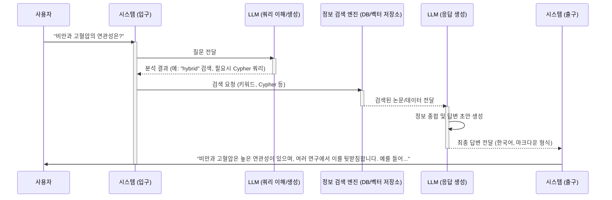

# Chapter 1: LLM 통합 (응답 생성 및 쿼리 이해)


안녕하세요! `SKN10-4th-1Team` 프로젝트의 첫 번째 튜토리얼에 오신 것을 환영합니다. 이 장에서는 우리 시스템의 "두뇌"라고 할 수 있는 **LLM(Large Language Model, 거대 언어 모델) 통합**에 대해 알아볼 거예요. LLM이 어떻게 사용자의 질문을 똑똑하게 알아듣고, 마치 전문 지식을 가진 비서처럼 답변을 만들어내는지 함께 살펴봅시다.

## LLM, 왜 필요한가요? 뇌와 같은 역할!

여러분은 혹시 복잡한 의학 논문을 찾아보거나, 특정 질병에 대한 최신 연구 동향이 궁금했던 적이 있나요? 수많은 정보 속에서 원하는 내용을 정확히 찾아내고 이해하는 것은 쉽지 않죠. 만약 누군가가 내 질문의 의도를 정확히 파악하고, 관련된 논문들을 찾아 핵심 내용을 요약해서 자연스러운 한국어로 설명해 준다면 얼마나 좋을까요?

바로 이 역할을 하는 것이 **LLM**입니다. 우리 시스템에서 LLM은 다음과 같은 핵심적인 문제들을 해결해 줍니다:

1.  **사용자 질문의 진짜 의미 파악**: 사용자가 "당뇨병에 좋은 최신 약물은 뭔가요?"라고 물었을 때, LLM은 이 질문이 '당뇨병', '약물', '최신 정보'에 대한 검색을 필요로 한다는 것을 이해합니다.
2.  **정보 검색 전략 수립**: 질문의 성격에 따라 단순히 정보를 찾는 것(벡터 검색)이 좋을지, 아니면 정보들 간의 관계(그래프 검색)를 파악하는 것이 좋을지, 혹은 둘 다 필요한지(하이브리드 검색) 결정합니다.
3.  **전문 검색어 생성**: 때로는 사용자의 한국어 질문을 데이터베이스가 더 잘 이해할 수 있도록 영어 용어로 번역하거나, [Neo4j 데이터 모델 및 연동](03_neo4j_데이터_모델_및_연동_.md)에서 정보를 효과적으로 찾기 위한 전문적인 검색 명령어(Cypher 쿼리)를 만들어내기도 합니다.
4.  **자연스러운 답변 생성**: 검색된 논문 정보와 데이터 간의 관계(그래프 컨텍스트)를 종합하여, 사람이 이해하기 쉬운 자연스러운 한국어 답변을 만들어냅니다.

간단히 말해, LLM은 우리 시스템이 사용자와 '대화'할 수 있게 만들어주는 인공지능 두뇌인 셈이죠!

## LLM의 핵심 기능 살펴보기

우리 시스템의 LLM은 크게 두 가지 핵심 기능을 수행합니다: **쿼리 이해**와 **응답 생성**.

### 1. 쿼리 이해: 사용자의 마음 읽기 🧐

사용자가 질문을 입력하면, LLM은 가장 먼저 그 질문의 의도를 파악하려고 노력합니다.

*   **의도 분석**: "코로나 백신 부작용에 대한 연구 찾아줘" 라는 질문과 "김 박사와 함께 연구한 사람들은 누구야?" 라는 질문은 필요한 정보의 종류가 다릅니다. LLM은 이러한 차이를 구분하여 어떤 방식으로 정보를 찾아야 할지 결정합니다.
    *   `rag_pipeline/graph_flow.py` 코드의 `_determine_query_type` 함수가 이 역할을 합니다. LLM에게 질문을 주고 어떤 검색 방식("vector", "graph", "hybrid")이 적합한지 묻는 것이죠.

    ```python
    # rag_pipeline/graph_flow.py 일부
    def _determine_query_type(self, state: QueryState) -> QueryState:
        query = state["query"]
        # ... (LLM을 사용하여 쿼리 유형 결정하는 프롬프트 구성) ...
        prompt = f"""
        당신은 연구 논문 검색 시스템의, 쿼리 의도 분석을 담당하는 전문가입니다.
        사용자 쿼리: {query}
        위 쿼리에 가장 적합한 검색 전략은 무엇인가요? "vector", "graph", "hybrid" 중 하나만 출력하세요.
        """
        # response = llm.model.generate_content(prompt) # LLM 호출
        # query_type = response.text.strip().lower()
        # ... (결과 처리) ...
        return {**state, "query_type": "hybrid"} # 예시: hybrid로 결정
    ```
    위 코드에서 LLM은 사용자의 질문(`query`)을 보고 "이 질문은 단순 정보 검색(vector)인가, 관계 중심 검색(graph)인가, 아니면 둘 다 필요한 복합 검색(hybrid)인가?"를 판단합니다.

*   **전문 검색어 생성 (Cypher 쿼리 생성)**: 만약 질문이 논문들 간의 관계나 특정 저자의 연구 네트워크처럼 복잡한 연결 정보를 필요로 한다면, LLM은 [Neo4j 데이터 모델 및 연동](03_neo4j_데이터_모델_및_연동_.md) 데이터베이스에서 정보를 가져올 수 있는 Cypher 쿼리를 생성할 수 있습니다. 마치 도서관 사서에게 "이 분야 책들을 찾아주세요"라고 하는 대신, "컴퓨터 과학 섹션의 인공지능 서브 카테고리에서 최근 5년간 출판된 책 목록을 주세요"라고 정확히 요청하는 것과 같아요.
    *   `rag_pipeline/neo4j_graph_chain.py`의 `Neo4jGraphChain` 클래스가 이 기능을 담당합니다. 이 클래스는 LLM을 사용하여 사용자의 자연어 질문을 Cypher 쿼리로 변환합니다.

    ```python
    # rag_pipeline/neo4j_graph_chain.py 의 프롬프트 일부
    cypher_generation_template = """
    You are an expert Neo4j Developer...
    Schema: {schema}
    Question: {question} # 사용자의 질문이 여기에 들어감
    Output a Cypher query...
    """
    # self.cypher_chain = GraphCypherQAChain.from_llm(...) # LLM과 연결
    # result = self.cypher_chain({"query": english_query}) # 질문으로 Cypher 생성 및 실행
    # cypher_query = result.get("intermediate_steps", [{}])[0].get("query", "")
    ```
    LLM은 위와 같은 지침(프롬프트)과 데이터베이스 구조(schema), 그리고 사용자 질문(question)을 바탕으로 Cypher 쿼리를 만들어냅니다. 예를 들어, 사용자가 "알츠하이머 연구를 많이 한 저자는 누구인가요?"라고 질문하면, LLM은 다음과 유사한 Cypher 쿼리를 생성할 수 있습니다:
    `MATCH (a:Author)-[:AUTHORED_BY]->(article:Article)-[:HAS_KEYWORD]->(:Keyword {term: 'Alzheimer'}) RETURN a.full_name, count(article) AS paper_count ORDER BY paper_count DESC LIMIT 5`

*   **쿼리 번역**: 우리 시스템의 논문 데이터는 주로 영어로 되어 있습니다. 사용자가 한국어로 질문해도 LLM이 이를 영어로 번역하여 더 정확한 검색을 돕기도 합니다.
    *   `rag_pipeline/graph_flow.py`의 `_translate_query_if_needed` 함수가 이 역할을 합니다.

    ```python
    # rag_pipeline/graph_flow.py 일부
    def _translate_query_if_needed(self, user_query: str) -> str:
        # ... (간단한 언어 감지 로직) ...
        # llm = self.llm
        prompt = f"""
        Translate the following Korean medical query into English...
        Korean query: {user_query}
        """
        # response = llm.model.generate_content(prompt) # LLM 호출
        # translated = response.text.strip()
        # return translated
        return "obesity and hypertension" # 예시: 번역된 결과
    ```
    사용자가 "비만과 고혈압의 연관성"이라고 질문하면, LLM이 "obesity and hypertension"과 같이 영어로 번역해줄 수 있습니다.

### 2. 응답 생성: 정보 요약 및 전달 📝

LLM은 단순히 정보를 찾아주는 것에서 그치지 않고, 그 정보를 바탕으로 사용자가 이해하기 쉬운 답변을 생성합니다.

*   **정보 종합**: 검색된 논문들, 그리고 그 논문들 사이의 관계(예: 공통 저자, 유사 키워드 등 그래프 컨텍스트)를 종합적으로 고려합니다.
*   **자연스러운 한국어 답변**: 딱딱한 정보 목록이 아니라, 마치 전문가가 설명해 주듯 자연스러운 문장으로 답변을 구성합니다. 이때 마크다운 문법을 활용하여 표나 목록 등으로 정보를 구조화하여 가독성을 높입니다.
    *   `rag_pipeline/llm.py`의 `GeminiLLM` 클래스에 있는 `generate_response` 함수가 이 역할을 합니다.

    ```python
    # rag_pipeline/llm.py 일부
    class GeminiLLM:
        def __init__(self, model_name="gemini-2.0-flash"):
            # ... (모델 초기화) ...
            self.system_prompt = """
            당신은 의학 연구 논문을 검색하고 질문에 답변하는 전문가 AI입니다. 
            ...답변은 항상 한국어로 제공해주세요...
            """
        
        def generate_response(self, query: str, retrieved_docs: List[Dict[str, Any]], ...) -> str:
            # prompt = self._construct_prompt(query, retrieved_docs, ...) # LLM에게 전달할 전체 지침 생성
            # response = self.model.generate_content(prompt) # LLM 호출
            # return response.text
            return "비만과 고혈압은 밀접한 관련이 있습니다. [논문1]에 따르면..." # 예시 답변
    ```
    `_construct_prompt` 함수는 시스템의 역할, 검색된 문서 정보, 관련 그래프 정보, 그리고 사용자 질문을 모두 합쳐 LLM에게 전달할 최종 지침서를 만듭니다. LLM은 이 지침서를 바탕으로 답변을 생성합니다. 예를 들어, "비만과 고혈압의 연관성"에 대한 여러 논문 정보를 바탕으로 "연구 결과에 따르면 비만은 고혈압의 주요 위험 요소로 간주됩니다. 논문 A (PMID:123)에서는..."과 같은 답변을 생성할 수 있습니다.

## LLM 통합, 한눈에 보기: 상호작용 흐름

그렇다면 이 모든 과정이 실제로 어떻게 흘러갈까요? 간단한 순서도로 표현해 보겠습니다.



1.  **사용자 질문**: 사용자가 시스템에 궁금한 점을 질문합니다 (예: "비만과 고혈압의 연관성은?").
2.  **쿼리 이해 (LLM)**: LLM이 질문의 의도를 파악하고, 어떤 정보가 필요한지, 어떻게 검색해야 할지 결정합니다. 필요하다면 Cypher 쿼리를 생성하거나 질문을 번역합니다.
3.  **정보 검색**: 결정된 전략에 따라 정보 검색 엔진(벡터 저장소 또는 Neo4j 데이터베이스)이 관련 논문이나 데이터를 찾습니다. 이 과정은 다음 챕터인 [하이브리드 RAG 파이프라인](02_하이브리드_rag_파이프라인_.md)과 [Neo4j 데이터 모델 및 연동](03_neo4j_데이터_모델_및_연동_.md)에서 더 자세히 다룹니다.
4.  **응답 생성 (LLM)**: LLM이 검색된 정보와 그래프 컨텍스트를 바탕으로, 사용자가 이해하기 쉬운 한국어 답변을 생성합니다.
5.  **답변 전달**: 생성된 답변이 사용자에게 보여집니다.

## 코드 속 LLM 들여다보기

이제 실제 코드에서 LLM이 어떻게 활용되는지 조금 더 자세히 살펴보겠습니다.

### 쿼리 유형 결정 (`rag_pipeline/graph_flow.py`의 `_determine_query_type`)

사용자 질문의 성격을 파악하여 가장 적절한 검색 방법을 결정하는 것은 매우 중요합니다.

```python
# rag_pipeline/graph_flow.py 일부
def _determine_query_type(self, state: QueryState) -> QueryState:
    query = state["query"]
    llm = GeminiLLM() # LLM 인스턴스 생성
    
    prompt = f"""
    당신은 연구 논문 검색 시스템의, 쿼리 의도 분석을 담당하는 전문가입니다.
    사용자의 쿼리를 분석하여 적절한 검색 전략을 결정해야 합니다.
    # ... (중략) ...
    사용자 쿼리: {query}
    위 쿼리에 가장 적합한 검색 전략은 무엇인가요? "vector", "graph", "hybrid" 중 하나만 출력하세요.
    """
    try:
        response = llm.model.generate_content(prompt) # LLM에게 판단 요청
        query_type = response.text.strip().lower()
        if query_type not in ["vector", "graph", "hybrid"]:
            query_type = "hybrid" # 기본값
    except Exception:
        query_type = "hybrid" # 오류 발생 시 기본값
    
    return {**state, "query_type": query_type}
```

-   `GeminiLLM()`: 우리 시스템에서 사용하는 LLM (여기서는 Gemini 모델)을 불러옵니다.
-   `prompt`: LLM에게 어떤 역할을 해야 하는지, 어떤 기준으로 판단해야 하는지 상세한 지침을 제공합니다. 사용자의 실제 질문(`query`)도 이 지침에 포함됩니다.
-   `llm.model.generate_content(prompt)`: LLM에게 지침(prompt)을 전달하고, LLM이 생성한 답변(여기서는 "vector", "graph", 또는 "hybrid")을 받습니다.

### 답변 생성 (`rag_pipeline/llm.py`의 `GeminiLLM.generate_response`)

정보 검색이 완료되면, LLM은 이 정보를 바탕으로 최종 답변을 만듭니다.

```python
# rag_pipeline/llm.py 일부
class GeminiLLM:
    # ... (초기화 및 시스템 프롬프트 생략) ...

    def generate_response(self, 
                         query: str, 
                         retrieved_docs: List[Dict[str, Any]], 
                         graph_context: Optional[Dict[str, Any]] = None,
                         # ... (다른 인자들 생략) ...
                         ) -> str:
        if not retrieved_docs and not graph_context: 
            return "검색된 정보나 그래프 컨텍스트가 없어 답변을 생성할 수 없습니다."
        
        # LLM에게 전달할 상세 지침(프롬프트) 구성
        prompt = self._construct_prompt(query, retrieved_docs, graph_context=graph_context, ...) 
                                     
        try:
            response = self.model.generate_content(prompt) # LLM 호출하여 답변 생성
            return response.text
        except Exception as e:
            return "응답 생성 중 오류가 발생했습니다."

    def _construct_prompt(self, query: str, retrieved_docs, graph_context, ...):
        # 시스템 역할 설명 (self.system_prompt)
        # + 검색된 논문 정보 (retrieved_docs)
        # + 그래프 컨텍스트 정보 (graph_context)
        # + 사용자 질문 (query)
        # 등을 조합하여 하나의 긴 프롬프트를 만듭니다.
        # 예: prompt = self.system_prompt + "\n### 검색된 논문 정보:\n" + formatted_docs + ...
        return "구성된 전체 프롬프트 문자열" # 실제로는 매우 긴 문자열
```

-   `generate_response` 함수는 사용자 질문(`query`), 검색된 문서 목록(`retrieved_docs`), 그리고 문서들 간의 관계 정보(`graph_context`) 등을 입력으로 받습니다.
-   `_construct_prompt` 함수는 이 모든 정보를 조합하여 LLM에게 전달할 최종 프롬프트를 만듭니다. 이 프롬프트에는 "당신은 의학 전문가 AI입니다. 다음 정보를 바탕으로 한국어로 답변해주세요..." 와 같은 지시와 함께 실제 데이터가 포함됩니다.
-   `self.model.generate_content(prompt)`를 통해 LLM은 이 방대한 프롬프트를 읽고 분석하여, 마치 사람이 작성한 것 같은 자연스러운 답변을 생성합니다.

## 정리하며

이번 장에서는 우리 시스템의 핵심 두뇌, LLM이 어떻게 사용자의 질문을 이해하고 자연스러운 답변을 생성하는지 알아보았습니다. LLM은 단순히 정보를 찾는 것을 넘어, 질문의 의도를 파악하고, 때로는 전문적인 검색어를 만들며, 최종적으로는 사람이 이해하기 쉬운 형태로 정보를 가공하여 전달하는 중요한 역할을 합니다.

하지만 LLM 혼자서 모든 것을 할 수는 없습니다. LLM이 더 똑똑하게 작동하기 위해서는 좋은 품질의 정보가 필요하고, 이 정보를 효과적으로 찾아 LLM에게 전달하는 과정이 중요합니다. 다음 장에서는 LLM이 최상의 답변을 만들 수 있도록 돕는 기술인 [하이브리드 RAG 파이프라인](02_하이브리드_rag_파이프라인_.md)에 대해 자세히 알아보겠습니다. LLM에게 어떤 정보를, 어떻게 먹여야 더 똑똑한 답변을 얻을 수 있는지 그 비밀을 파헤쳐 볼 예정이니 기대해주세요!

---

Generated by [AI Codebase Knowledge Builder](https://github.com/The-Pocket/Tutorial-Codebase-Knowledge)