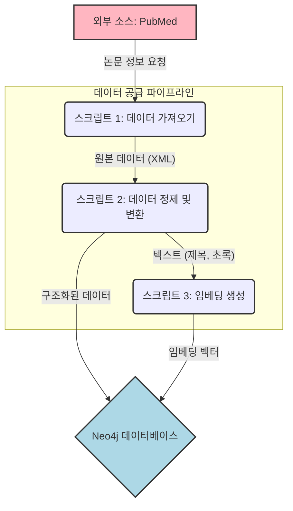
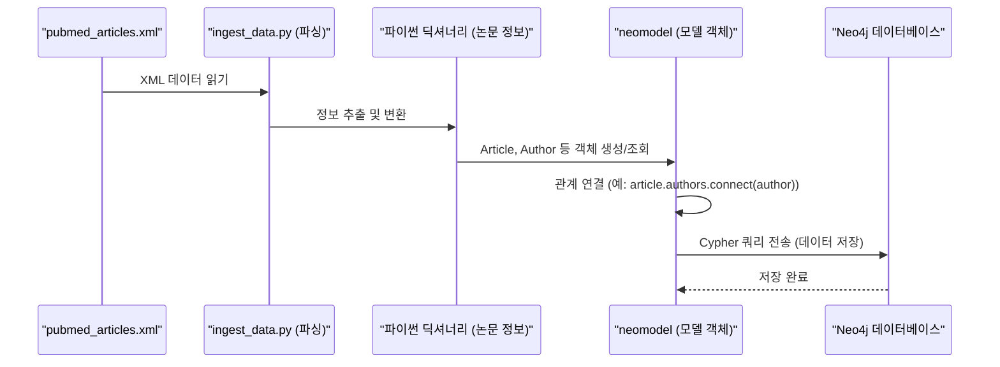

# Chapter 2: 데이터 수집 및 전처리 (스크립트)


안녕하세요! 이전 [제1장: 그래프 데이터 모델 (Neo4j 모델)](01_그래프_데이터_모델__neo4j_모델__.md)에서는 우리 프로젝트의 정보를 담을 '그릇'에 해당하는 그래프 데이터 모델을 설계하는 방법을 배웠습니다. 멋진 설계도가 완성되었으니, 이제 그 설계도에 맞춰 실제 내용물을 채워 넣을 차례입니다. 바로 '데이터'를 말이죠!

데이터가 없다면 아무리 훌륭한 모델이라도 쓸모가 없겠죠? 마치 잘 지어진 도서관에 책이 한 권도 없는 것과 같아요. 이번 장에서는 우리 연구 정보 시스템에 생명을 불어넣을 데이터를 어떻게 가져오고, 우리가 사용할 수 있는 형태로 깨끗하게 다듬는지, 그 과정을 함께 살펴보겠습니다. 이 과정을 '데이터 공급 파이프라인'이라고 부르는데, 마치 원자재를 수입해서 공장에서 가공한 후, 창고에 보관하는 것과 비슷하답니다.

## 데이터는 어디서 와서 어디로 가는 걸까요? 데이터 공급 파이프라인!

우리 프로젝트는 최신 연구 동향을 파악하고, 논문 간의 관계를 탐색하는 것을 목표로 합니다. 그렇다면 가장 중요한 질문은 "어떤 논문 정보를, 어디서 가져올 것인가?" 입니다. 세상에는 수많은 학술 정보 데이터베이스가 있지만, 의학 및 생명과학 분야에서 가장 널리 사용되는 것 중 하나가 바로 **PubMed**입니다.

PubMed에는 매일같이 새로운 논문들이 등록됩니다. 우리는 이 PubMed에서 원하는 논문 정보를 가져와서, 지난 장에서 설계한 `Article`, `Author`, `Keyword`, `Journal` 노드 형태로 변환하고, 관계를 맺어 Neo4j 데이터베이스에 저장해야 합니다. 이 일련의 과정을 자동화해주는 것이 바로 '데이터 수집 및 전처리 스크립트'입니다.

이 과정을 그림으로 표현하면 다음과 같아요:



1.  **데이터 가져오기 (`pubmed_fetch.py`):** PubMed 같은 외부 소스에서 필요한 논문 정보를 가져옵니다. 보통 복잡한 형태의 원본 데이터(예: XML 파일)로 받아옵니다.
2.  **데이터 정제 및 변환 (`ingest_data.py`):** 가져온 원본 데이터를 우리가 정의한 [그래프 데이터 모델](01_그래프_데이터_모델__neo4j_모델__.md)에 맞게끔 가공합니다. 필요한 정보만 추출하고, 형식을 맞추고, 오류를 수정하는 과정이 포함됩니다.
3.  **임베딩 생성 (`generate_embeddings.py` 또는 `ingest_data.py` 내 기능):** 논문의 제목이나 초록 같은 텍스트 정보를 AI가 이해할 수 있는 숫자 표현(임베딩 벡터)으로 변환합니다. 이 과정은 나중에 [언어 모델 연동 (GeminiLLM)](03_언어_모델_연동__geminillm__.md) 및 [벡터/그래프 검색 저장소 (Neo4jVectorSearch)](04_벡터_그래프_검색_저장소__neo4jvectorsearch__.md)에서 중요한 역할을 합니다.
4.  **데이터베이스에 저장:** 정제되고 변환된 데이터와 생성된 임베딩 벡터를 Neo4j 데이터베이스에 노드와 관계로 저장합니다.

이제 각 단계를 좀 더 자세히 살펴보겠습니다.

## 1단계: 외부에서 데이터 가져오기 (feat. `scripts/pubmed_fetch.py`)

첫 번째 임무는 PubMed에서 논문 데이터를 가져오는 것입니다. `scripts/pubmed_fetch.py` 스크립트가 이 역할을 담당합니다. PubMed는 Entrez라는 API를 통해 프로그래밍 방식으로 데이터에 접근할 수 있도록 지원합니다.

**Entrez 설정하기**

PubMed API를 사용하려면 먼저 NCBI(미국 국립생물정보센터)에 자신의 이메일 주소를 알려줘야 합니다. 마치 도서관 출입증을 발급받는 것과 같아요.

```python
# scripts/pubmed_fetch.py
from Bio import Entrez
import os
from dotenv import load_dotenv

load_dotenv() # .env 파일에서 환경 변수 로드

ENTREZ_EMAIL = os.getenv("ENTREZ_EMAIL", "your.email@example.com")
Entrez.email = ENTREZ_EMAIL # NCBI에 알릴 이메일 주소
print(f"Entrez 이메일 설정됨: {Entrez.email}")
```
`.env` 파일에 여러분의 실제 이메일 주소를 `ENTREZ_EMAIL` 변수로 저장해두면, 스크립트가 이를 읽어 자동으로 설정합니다.

**최신 논문 ID 검색하기**

어떤 논문을 가져올지 정해야겠죠? 예를 들어, "최근 90일 동안 발행된 'COVID-19' 관련 논문 300개"와 같이 검색 조건을 설정할 수 있습니다. `search_recent_pubmed_ids` 함수가 이 일을 합니다.

```python
# scripts/pubmed_fetch.py (search_recent_pubmed_ids 함수 일부)
def search_recent_pubmed_ids(count=300, days=90):
    print(f"최근 {days}일 동안의 PubMed 논문 ID {count}개를 검색합니다...")
    handle = Entrez.esearch(db="pubmed",
                           term="covid 19", # 검색어 예시
                           retmax=str(count), # 최대 결과 수
                           reldate=days)      # 최근 N일
    record = Entrez.read(handle)
    handle.close()
    return record["IdList"] # 논문 ID (PMID) 리스트 반환
```
이 함수는 PubMed에 "이런 조건의 논문 ID들을 알려주세요"라고 요청하고, 응답으로 받은 ID 목록(PMID 리스트)을 반환합니다.

**논문 상세 정보 가져오기**

논문 ID들을 얻었다면, 이제 각 ID에 해당하는 상세 정보를 가져올 차례입니다. `fetch_pubmed_details` 함수가 이 역할을 하며, 논문 정보를 XML 형식으로 받아옵니다. XML은 `<tag>내용</tag>`처럼 태그로 구조화된 텍스트 데이터입니다.

```python
# scripts/pubmed_fetch.py (fetch_pubmed_details 함수 일부)
def fetch_pubmed_details(pmids, batch_size=100):
    all_articles_xml = []
    # ... (pmids를 batch_size만큼 나눠서 처리하는 로직) ...
    try:
        # ID 목록을 주고, XML 형식으로 상세 정보 요청
        handle = Entrez.efetch(db="pubmed", id=batch_ids, retmode="xml")
        xml_data = handle.read() # 응답을 XML 문자열로 읽음
        handle.close()
        # ... (개별 Article XML 추출 로직) ...
        # all_articles_xml 리스트에 추가
    except Exception as e:
        print(f"오류 발생: {e}")
    return all_articles_xml
```
이 함수는 가져온 XML 데이터들을 모아서, 최종적으로 `data/pubmed_articles.xml`이라는 파일에 저장합니다. 이 파일이 바로 우리 데이터 파이프라인의 '원자재'가 됩니다.

## 2단계: 가져온 데이터 이해하고 정리하기 (feat. `scripts/ingest_data.py`)

`pubmed_articles.xml` 파일에는 논문에 대한 온갖 정보가 담겨있지만, 아직은 우리가 바로 사용하기 어려운 형태입니다. `scripts/ingest_data.py` 스크립트는 이 XML 파일을 읽어서 우리가 필요한 정보(제목, 저자, 초록, 출판 연도, 학술지, 키워드 등)만 쏙쏙 골라내는 '파싱(parsing)' 작업을 합니다.

**XML 파싱하기**

`parse_pubmed_xml` 함수가 XML 구조를 탐색하며 정보를 추출합니다. 예를 들어 논문 제목은 보통 `<ArticleTitle>` 태그 안에 들어있고, PMID는 `<PMID>` 태그 안에 있습니다.

```python
# scripts/ingest_data.py (parse_pubmed_xml 함수 일부)
import xml.etree.ElementTree as ET # XML 처리 라이브러리

def parse_pubmed_xml(xml_filepath):
    articles_data = []
    tree = ET.parse(xml_filepath) # XML 파일 로드
    root = tree.getroot()

    for article_element in root.findall('.//PubmedArticle'):
        article_info = {}
        # PMID 추출
        pmid_el = article_element.find('.//MedlineCitation.//PMID')
        article_info['pmid'] = pmid_el.text if pmid_el else None
        # 제목 추출
        title_el = article_element.find('.//Article/ArticleTitle')
        article_info['title'] = title_el.text if title_el else "제목 없음"
        # ... (초록, 저자, 학술지, 키워드 등 추출 로직) ...
        articles_data.append(article_info)
    return articles_data
```
이 함수는 각 논문 정보를 파이썬 딕셔너리 형태로 만들어서 리스트에 담아 반환합니다. 예를 들면 이런 모습이죠:

```python
# 파싱된 논문 정보 예시 (파이썬 딕셔너리)
{
    'pmid': '12345678',
    'title': 'A Great Paper about Stuff',
    'abstract': 'This paper discusses many important things...',
    'publication_year': 2023,
    'authors': [{'full_name': 'John Doe'}, {'full_name': 'Jane Smith'}],
    'journal': {'name': 'Journal of Cool Science'},
    'keywords': ['stuff', 'science', 'cool']
}
```
이제 데이터가 훨씬 다루기 쉬운 형태로 바뀌었습니다!

## 3단계: 데이터를 우리 모델에 맞게 저장하기 (feat. `ingest_data.py`와 `neomodel`)

정리된 파이썬 딕셔너리 형태의 논문 정보들을 이제 [제1장: 그래프 데이터 모델 (Neo4j 모델)](01_그래프_데이터_모델__neo4j_모델__.md)에서 정의한 `neomodel` 클래스(Article, Author 등)를 사용해 Neo4j 데이터베이스에 저장할 차례입니다. `ingest_data_to_neo4j` 함수가 이 마법을 부립니다.

**Neo4j에 노드와 관계 만들기**

각 논문 정보 딕셔너리를 순회하면서, 해당하는 `Article` 노드를 만들고, 관련 정보(저자, 학술지, 키워드)에 대한 노드들도 만들거나 찾아서 관계를 맺어줍니다.

```python
# scripts/ingest_data.py (ingest_data_to_neo4j 함수 일부)
from api.models import Article, Author, Journal, Keyword # 1장에서 정의한 모델

def ingest_data_to_neo4j(articles_data):
    for article_info in articles_data:
        # Article 노드 생성 또는 업데이트
        article_node, created = Article.get_or_create(
            {'pmid': article_info['pmid']}, # 고유 ID로 찾거나 생성
            title=article_info['title'],
            abstract=article_info.get('abstract')
            # ... 다른 Article 속성들 ...
        )
        if created: article_node.save()


        # Author 노드 생성 및 Article과 연결
        for author_data in article_info.get('authors', []):
            author_node, _ = Author.get_or_create(
                {'full_name': author_data['full_name']}
            )
            if created: author_node.save()
            article_node.authors.connect(author_node) # 관계 연결!

        # ... (Journal, Keyword 노드 생성 및 연결 로직) ...
    print("데이터 적재 완료!")
```
`get_or_create`는 해당 정보로 노드가 이미 존재하면 가져오고, 없으면 새로 만드는 편리한 기능입니다. `connect` 메소드는 두 노드 사이에 관계를 만듭니다. 이 과정을 통해 XML 데이터가 Neo4j 그래프 데이터베이스 안에 멋진 연결망으로 재탄생합니다!

이 과정을 순서도로 나타내면 다음과 같습니다:



참고로, 데이터를 처음 적재하기 전에는 `install_neomodel_labels()` 함수를 실행하여 Neo4j에 우리 모델의 구조(인덱스, 제약조건 등)를 알려주는 것이 좋습니다. 이 함수는 `ingest_data.py` 스크립트 내에서 호출되도록 설정되어 있을 수 있습니다.

## 4단계 (특별 보너스): 텍스트에 숨겨진 의미를 숫자로! 임베딩 생성

우리 시스템은 단순한 키워드 검색을 넘어, "이 논문과 의미적으로 유사한 다른 논문은 무엇일까?"와 같은 질문에도 답할 수 있기를 원합니다. 이를 가능하게 하는 핵심 기술이 바로 **임베딩(Embedding)**입니다.

임베딩은 논문의 제목이나 초록 같은 텍스트를 컴퓨터가 이해하고 비교할 수 있도록 숫자로 이루어진 긴 목록(벡터)으로 변환하는 과정입니다. 마치 각 단어나 문장에 고유한 '좌표'를 부여해서, 의미가 비슷한 단어나 문장끼리는 좌표 공간에서 가깝게 위치하도록 만드는 것과 같아요.

**임베딩은 어떻게 만들까요?**

이 변환 작업은 보통 강력한 [언어 모델 연동 (GeminiLLM)](03_언어_모델_연동__geminillm__.md) (예: OpenAI의 모델)을 통해 이루어집니다. `ingest_data.py` 스크립트나 `scripts/generate_embeddings.py` 스크립트에는 `create_embedding`이라는 함수가 포함되어 있어 이 작업을 수행합니다.

```python
# scripts/ingest_data.py 또는 scripts/generate_embeddings.py (create_embedding 함수 일부)
# from openai import OpenAI # OpenAI 라이브러리 사용

# client = OpenAI(api_key=OPENAI_API_KEY) # API 키 설정 필요

def create_embedding(text, model="text-embedding-3-large"):
    if not text: return None
    try:
        response = client.embeddings.create(input=text, model=model)
        return response.data[0].embedding # 숫자 벡터 반환
    except Exception as e:
        print(f"임베딩 오류: {e}")
        return None
```
이 함수는 텍스트를 입력받아 언어 모델 API에 전달하고, 결과로 숫자 벡터(임베딩)를 돌려받습니다. 이 벡터는 `Article` 노드의 `title_embedding`, `abstract_embedding`, `combined_embedding` 같은 `JSONProperty` 속성에 저장됩니다. (기억나시죠? [제1장: 그래프 데이터 모델 (Neo4j 모델)](01_그래프_데이터_모델__neo4j_모델__.md)에서 이 속성들을 정의했었습니다!)

`ingest_data.py`는 `USE_EMBEDDINGS` 환경 변수가 `True`로 설정되어 있고 `OPENAI_API_KEY`가 제공되면, 데이터 적재 시점에 자동으로 제목과 초록에 대한 임베딩을 생성하여 저장합니다.

```python
# scripts/ingest_data.py (ingest_data_to_neo4j 함수 내 임베딩 부분)
# ... Article 노드 생성 후 ...
if USE_EMBEDDINGS:
    title = article_info['title']
    abstract = article_info.get('abstract')

    # 제목 임베딩
    article_node.title_embedding = create_embedding(title)
    # 초록 임베딩
    article_node.abstract_embedding = create_embedding(abstract)
    # ... (통합 임베딩도 유사하게 생성 및 저장) ...
    article_node.save() # 변경사항 저장
```

만약 이미 데이터베이스에 데이터가 저장되어 있고, 나중에 임베딩을 추가하고 싶다면 `scripts/generate_embeddings.py` 스크립트를 사용할 수 있습니다. 이 스크립트는 데이터베이스에 있는 Article들을 조회하여 임베딩이 없는 경우 새로 생성해줍니다.

이 임베딩 정보는 나중에 [벡터/그래프 검색 저장소 (Neo4jVectorSearch)](04_벡터_그래프_검색_저장소__neo4jvectorsearch__.md)에서 사용되어 의미 기반 검색을 가능하게 합니다.

## 스크립트 실행해보기 (간단 가이드)

이 멋진 데이터 파이프라인을 직접 실행해보고 싶으신가요? 터미널(명령 프롬프트)에서 다음 명령어들을 순서대로 실행하면 됩니다.

1.  **환경 설정 확인:**
    *   `.env` 파일이 프로젝트 루트 디렉토리에 있는지 확인하세요.
    *   `NEO4J_BOLT_URL`, `ENTREZ_EMAIL` (여러분의 이메일), `OPENAI_API_KEY` (임베딩 사용 시) 등이 올바르게 설정되어 있어야 합니다.

2.  **PubMed 데이터 가져오기:**
    ```bash
    python scripts/pubmed_fetch.py
    ```
    이 명령을 실행하면 `data/pubmed_articles.xml` 파일이 생성될 것입니다.

3.  **데이터 파싱 및 Neo4j에 적재 (임베딩 포함 가능):**
    ```bash
    python scripts/ingest_data.py
    ```
    이 명령은 `pubmed_articles.xml` 파일을 읽어 Neo4j 데이터베이스에 정보를 저장합니다. `USE_EMBEDDINGS` 설정에 따라 임베딩도 함께 생성될 수 있습니다.

4.  **(선택) 기존 데이터에 임베딩 생성/업데이트:**
    ```bash
    python scripts/generate_embeddings.py
    ```
    이 스크립트는 이미 Neo4j에 저장된 논문들에 대해 임베딩을 생성하거나 업데이트할 때 사용합니다. 실행하면 어떤 작업을 할지 메뉴가 나타납니다.

각 스크립트를 실행하면 진행 상황이나 결과에 대한 메시지가 터미널에 출력될 것입니다.

## 정리하며

이번 장에서는 우리 프로젝트의 '연료'에 해당하는 데이터를 어떻게 확보하고 가공하는지, 그 전체적인 '데이터 공급 파이프라인'에 대해 알아보았습니다.
*   외부 소스(PubMed)에서 원본 데이터를 가져오는 방법 (`pubmed_fetch.py`)
*   원본 데이터를 우리가 설계한 [그래프 데이터 모델](01_그래프_데이터_모델__neo4j_모델__.md)에 맞게 파싱하고 변환하는 방법 (`ingest_data.py`)
*   변환된 데이터를 `neomodel`을 사용해 Neo4j 데이터베이스에 노드와 관계로 저장하는 방법
*   텍스트 데이터의 의미를 AI가 이해할 수 있도록 숫자 벡터(임베딩)로 변환하고 저장하는 방법

이제 우리 도서관(Neo4j 데이터베이스)에는 책(논문 정보)들이 채워지기 시작했습니다! 심지어 각 책의 내용을 요약한 특별한 코드(임베딩)까지 준비되었죠.

다음 장에서는 이 데이터와 임베딩을 활용하여 어떻게 더 '똑똑한' 검색과 분석을 할 수 있는지, 그 핵심 도구인 언어 모델과의 연동에 대해 알아보겠습니다.

바로 [제3장: 언어 모델 연동 (GeminiLLM)](03_언어_모델_연동__geminillm__.md)에서 만나요!

---

Generated by [AI Codebase Knowledge Builder](https://github.com/The-Pocket/Tutorial-Codebase-Knowledge)