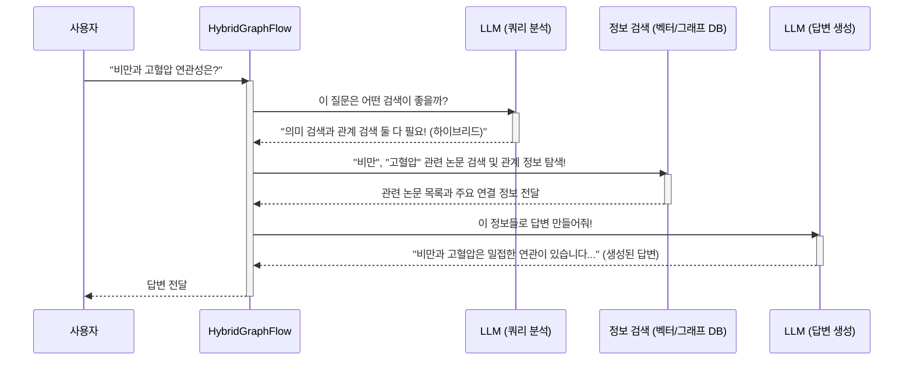

# Chapter 2: 하이브리드 RAG 파이프라인

지난 [Chapter 1: LLM 통합 (응답 생성 및 쿼리 이해)](01_llm_통합__응답_생성_및_쿼리_이해__.md)에서는 우리 시스템의 "두뇌"인 LLM이 어떻게 사용자의 질문을 이해하고 답변을 생성하는지에 대해 알아보았습니다. LLM이 똑똑하게 작동하려면 정확하고 풍부한 정보가 뒷받침되어야 하죠. 이번 장에서는 바로 이 LLM에게 최적의 정보를 찾아 제공하는 핵심 과정, **하이브리드 RAG 파이프라인**에 대해 함께 탐험해 보겠습니다!

## 똑똑한 정보 탐험가, 하이브리드 RAG 파이프라인은 왜 필요할까요?

여러분, 만약 "코로나 바이러스 변이와 백신 효과 감소의 연관성에 대한 최신 연구 논문들을 찾아주고, 특히 '델타 변이'와 '면역 회피' 키워드 사이의 관계를 중심으로 설명해줘"라는 복잡한 질문을 받았다고 상상해 보세요. 단순히 책 한 권을 찾는 것과는 차원이 다른 문제죠? 최신 논문을 의미적으로 찾아야 하고(벡터 검색), 특정 키워드 간의 관계도 파악해야(그래프 검색) 합니다.

바로 이런 복잡한 정보 요구를 해결하기 위해 **하이브리드 RAG 파이프라인**이 필요합니다. 여기서 RAG는 "Retrieval Augmented Generation"의 약자로, 정보를 '검색(Retrieval)'하고, 이 검색된 정보를 바탕으로 LLM이 답변을 '생성(Generation)'하는 것을 의미합니다. "하이브리드"라는 말은 한 가지 방법이 아닌, 여러 검색 전략을 똑똑하게 섞어서 사용한다는 뜻이에요.

우리 시스템의 하이브리드 RAG 파이프라인은 마치 **도서관의 슈퍼 사서와 노련한 연구팀장이 합쳐진 역할**을 합니다.
*   **슈퍼 사서**: 사용자의 질문을 듣고, 방대한 논문 자료실에서 의미가 비슷한 논문(벡터 검색)을 찾아내거나, 특정 저자나 연구 주제들 사이의 연결고리(그래프 검색)를 찾아냅니다.
*   **연구팀장**: 슈퍼 사서가 찾아온 다양한 정보들을 종합하고 분석하여, 사용자의 질문에 대한 명쾌하고 깊이 있는 보고서(답변)를 작성합니다.

이 파이프라인은 질문의 유형을 스스로 분석하고, 그에 맞는 최적의 검색 전략(벡터, 그래프, 또는 둘 다)을 동적으로 결정하여 사용자에게 가장 정확하고 유용한 정보를 제공하려고 노력합니다.

## 하이브리드 RAG 파이프라인의 핵심 작동 원리

우리 `SKN10-4th-1Team` 프로젝트의 하이브리드 RAG 파이프라인은 크게 다음과 같은 단계를 거쳐 작동합니다. 이 과정은 `rag_pipeline/graph_flow.py` 파일의 `HybridGraphFlow` 클래스에 잘 나타나 있습니다.

1.  **🤔 쿼리 유형 결정 (Query Type Determination)**:
    *   가장 먼저, [Chapter 1: LLM 통합 (응답 생성 및 쿼리 이해)](01_llm_통합__응답_생성_및_쿼리_이해__.md)에서 배운 LLM이 사용자의 질문을 분석합니다.
    *   "이 질문은 단순 정보 검색(vector)이 좋을까, 관계 중심 검색(graph)이 좋을까, 아니면 둘 다 필요한 복합 검색(hybrid)일까?"를 판단합니다.
    *   예를 들어, "당뇨병이란 무엇인가?"는 벡터 검색, "김 박사와 공동 연구한 사람은?"은 그래프 검색, "당뇨병 최신 치료법과 관련된 주요 연구 그룹은?"은 하이브리드 검색이 적합할 수 있습니다.

2.  **🔍 정보 검색 (Information Retrieval)**: 결정된 쿼리 유형에 따라 실제 정보 검색을 수행합니다.
    *   **벡터 검색 (Vector Search)**: 사용자의 질문과 의미적으로 가장 유사한 논문들을 찾아냅니다. 마치 도서관에서 '인공지능' 관련 책을 찾을 때, 제목뿐 아니라 내용이 비슷한 책까지 찾아주는 것과 같아요.
    *   **그래프 검색 (Graph Search)**: 논문, 저자, 키워드 등 데이터들 사이의 연결 관계를 탐색합니다. 예를 들어, 특정 논문을 인용한 다른 논문들을 찾거나, 특정 질병과 관련된 유전자들의 네트워크를 보여줄 수 있습니다. 이 부분은 [Chapter 3: Neo4j 데이터 모델 및 연동](03_neo4j_데이터_모델_및_연동_.md)에서 자세히 다룰 Neo4j 그래프 데이터베이스를 활용합니다.
    *   **하이브리드 검색 (Hybrid Search)**: 벡터 검색으로 관련 문서를 먼저 찾은 후, 이 문서들과 관련된 그래프 정보를 추가로 탐색하거나, 두 검색 결과를 적절히 조합합니다.

3.  **엮고 요약하기 (Context Gathering and Consolidation)**:
    *   검색된 문서들과 그래프 정보(예: 주요 저자, 공통 키워드, 문서 간 연결 관계)를 모읍니다.
    *   LLM이 답변을 생성하는 데 필요한 핵심 정보들을 깔끔하게 정리하고 요약합니다.

4.  **📝 답변 생성 (Response Generation)**:
    *   정리된 정보들을 [Chapter 1: LLM 통합 (응답 생성 및 쿼리 이해)](01_llm_통합__응답_생성_및_쿼리_이해__.md)에서 배운 LLM에게 전달합니다.
    *   LLM은 이 정보를 바탕으로 사용자가 이해하기 쉬운 자연스러운 한국어 답변을 생성합니다.

5.  **✨ (선택 사항) 답변 품질 평가 및 추가 검색 (Response Evaluation & Augmentation)**:
    *   때로는 생성된 답변이 충분하지 않거나, 더 최신의 정보가 필요할 수 있습니다.
    *   이 경우, LLM이 스스로 답변의 품질을 평가하고, 필요하다면 외부 웹 검색(예: Tavily API 사용)을 통해 추가 정보를 수집하여 답변을 보강하기도 합니다.

이 모든 과정이 `LangGraph`라는 도구를 통해 마치 잘 짜인 연극처럼 순서대로, 또는 조건에 따라 유연하게 흘러갑니다.

## 하이브리드 RAG 파이프라인 사용해보기 (간단 예시)

우리 시스템에서 사용자가 질문을 하면, 내부적으로 `HybridGraphFlow` 객체의 `query` 메소드가 호출됩니다.

```python
# api/views.py 에서 사용자가 질문했을 때 내부적으로 일어나는 일 (매우 간략화된 예시)

# HybridGraphFlow 인스턴스는 미리 준비되어 있습니다.
# graph_rag = HybridGraphFlow() # 실제로는 앱 시작 시 초기화

# 사용자가 "비만과 고혈압의 연관성" 이라고 질문했다고 가정해봅시다.
user_question = "비만과 고혈압의 연관성"
previous_chat = [] # 이전 대화 내용 (지금은 없다고 가정)

# 파이프라인에 질문을 전달하고 결과를 받습니다!
result = graph_rag.query(user_question, previous_chat)

# 파이프라인이 생성한 답변과 부가 정보를 확인합니다.
print(f"생성된 답변: {result['answer']}")
print(f"참고한 논문 수: {len(result['retrieved_docs'])}")
if result['retrieved_docs']:
    print(f"첫 번째 참고 논문 제목: {result['retrieved_docs'][0]['title']}")
```

위 코드에서 `graph_rag.query(...)`를 호출하면, `HybridGraphFlow` 내부에서는 앞서 설명한 쿼리 유형 결정, 정보 검색, 답변 생성 등의 복잡한 과정들이 자동으로 실행됩니다. 최종적으로 `result`에는 LLM이 생성한 답변(`answer`)과 검색 과정에서 찾아낸 관련 논문 목록(`retrieved_docs`) 등이 담겨 사용자에게 전달됩니다.

## 파이프라인 내부 동작 흐름 살펴보기

그렇다면 `HybridGraphFlow`가 `query` 메소드를 호출받았을 때, 내부에서는 어떤 일들이 벌어질까요? 간단한 순서도로 표현하면 다음과 같습니다.



이러한 흐름을 코드로 좀 더 자세히 살펴보겠습니다. 핵심은 `rag_pipeline/graph_flow.py` 파일의 `HybridGraphFlow` 클래스입니다.

### 1. 파이프라인 준비 (`__init__`, `_build_graph`)

`HybridGraphFlow`가 처음 만들어질 때, 필요한 모든 도구들을 챙기고, 작업 순서도(워크플로우)를 미리 정의해둡니다.

```python
# rag_pipeline/graph_flow.py 일부
class HybridGraphFlow:
    def __init__(self):
        # 정보 검색을 위한 도구들 준비
        self.vector_search = Neo4jVectorSearch() # 의미 기반 검색기
        self.llm = GeminiLLM()                   # 우리의 LLM (Chapter 1)
        self.graph_chain = Neo4jGraphChain()     # 관계 기반 검색기 (Chapter 3 연관)
        self.tavily_search = TavilySearch()      # 외부 웹 검색 도구 (선택적)
        
        # LangGraph를 사용해 작업 흐름(워크플로우) 구성
        self.workflow = self._build_graph()
```
-   `Neo4jVectorSearch`: 논문을 의미적으로 검색합니다.
-   `GeminiLLM`: 질문을 이해하고 답변을 생성하는 LLM입니다. ([Chapter 1: LLM 통합 (응답 생성 및 쿼리 이해)](01_llm_통합__응답_생성_및_쿼리_이해__.md)에서 다뤘죠!)
-   `Neo4jGraphChain`: Neo4j 데이터베이스에서 관계 정보를 검색합니다. ([Chapter 3: Neo4j 데이터 모델 및 연동](03_neo4j_데이터_모델_및_연동_.md)에서 자세히 배울 거예요.)
-   `_build_graph()`: 이 함수 안에서 `LangGraph`를 사용하여 각 작업 단계(노드)와 단계 간의 연결(엣지)을 정의합니다. 마치 요리 레시피를 짜는 것과 같아요.

```python
# rag_pipeline/graph_flow.py 의 _build_graph() 일부
def _build_graph(self) -> StateGraph:
    graph = StateGraph(QueryState) # 전체 작업 상태를 저장할 가방(QueryState)을 가진 그래프

    # 주요 작업 단계(레시피의 각 과정)들을 그래프에 추가
    graph.add_node("determine_query_type", self._determine_query_type) # 1. 질문 유형 분석
    graph.add_node("vector_search", self._vector_search)             # 2a. 의미 검색
    graph.add_node("graph_search", self._graph_search)               # 2b. 관계 검색
    graph.add_node("hybrid_search", self._hybrid_search)             # 2c. 복합 검색
    # ... (정보 통합, 컨텍스트 추출 등 다른 단계들) ...
    graph.add_node("generate_response", self._generate_response)     # 3. 최종 답변 생성

    # 작업 순서(레시피 과정 연결) 정의
    graph.set_entry_point("determine_query_type") # 여기서부터 시작!

    # 질문 유형 분석 결과에 따라 다음 단계를 다르게 연결
    graph.add_conditional_edges(
        "determine_query_type", # '질문 유형 분석' 단계가 끝나면
        lambda state: state["query_type"], # 현재 상태(state)에서 'query_type'을 보고
        { # 다음 단계 결정
            "vector": "vector_search",   # 'vector'면 '의미 검색'으로
            "graph": "graph_search",     # 'graph'면 '관계 검색'으로
            "hybrid": "hybrid_search"    # 'hybrid'면 '복합 검색'으로
        }
    )
    # 예: '의미 검색' 후에는 '최종 답변 생성' 단계로 이동
    graph.add_edge("vector_search", "generate_response") 
    # (실제로는 중간에 정보 통합 단계 등이 더 있을 수 있습니다)
    
    return graph.compile() # 레시피 완성!
```
-   `StateGraph(QueryState)`: `LangGraph`는 `QueryState`라는 특별한 가방에 각 단계의 결과물을 담아 다음 단계로 전달합니다.
-   `add_node()`: 파이프라인의 각 처리 단계를 등록합니다. (예: `_determine_query_type` 함수가 하나의 단계)
-   `add_conditional_edges()`: "만약 A 조건이면 B 단계로, C 조건이면 D 단계로 가세요"처럼 조건에 따라 흐름을 제어합니다.

### 2. 질문 유형에 따른 검색 전략 실행

사용자의 질문이 들어오면, `_determine_query_type` 함수가 LLM을 이용해 질문의 성격을 파악하고, 그 결과에 따라 `_vector_search`, `_graph_search`, 또는 `_hybrid_search` 함수가 호출됩니다.

```mermaid
graph TD
    A[사용자 질문 입력] --> B{쿼리 유형 분석 (LLM)};
    B -- "의미 중심 질문" --> C[벡터 검색 수행<br>(유사 논문 찾기)];
    B -- "관계 중심 질문" --> D[그래프 검색 수행<br>(연결고리 찾기)];
    B -- "복합적 질문" --> E[하이브리드 검색 수행<br>(벡터 + 그래프)];
    C --> F[정보 통합 및 답변 생성 준비];
    D --> F;
    E --> F;
    F --> G[LLM을 통해 답변 생성];
    G --> H[사용자에게 답변 전달];
```

-   **벡터 검색 (`_vector_search`)**:
    ```python
    # rag_pipeline/graph_flow.py 의 _vector_search() 일부
    def _vector_search(self, state: QueryState) -> QueryState:
        query = state["query"] # 사용자의 질문
        # vector_search 도구를 사용해 의미적으로 유사한 논문 검색
        vector_results = self.vector_search.semantic_search(query, top_k=10)
        # 검색된 결과를 'combined_results'라는 이름으로 가방(state)에 저장
        return {**state, "combined_results": vector_results}
    ```
    질문과 내용이 비슷한 논문들을 찾아서 결과 가방에 넣습니다.

-   **그래프 검색 (`_graph_search`)**:
    ```python
    # rag_pipeline/graph_flow.py 의 _graph_search() 일부
    def _graph_search(self, state: QueryState) -> QueryState:
        query = state["query"] # 사용자의 질문
        # graph_chain 도구를 사용해 그래프 데이터베이스에서 관계 검색
        # (내부적으로 LLM이 Cypher 쿼리를 생성할 수도 있음 - Chapter 1 내용)
        chain_result = self.graph_chain.search(query) 
        graph_results = chain_result.get("results", []) # 실제 결과 추출
        # 검색된 결과를 'combined_results'로 가방(state)에 저장
        return {
            **state, 
            "combined_results": graph_results,
            "graph_search_output": chain_result # 상세 결과도 저장
        }
    ```
    질문과 관련된 데이터(논문, 저자, 키워드 등) 간의 연결 관계를 [Neo4j 데이터 모델 및 연동](03_neo4j_데이터_모델_및_연동_.md)을 통해 찾아서 결과 가방에 넣습니다.

-   **하이브리드 검색 (`_hybrid_search`)**:
    ```python
    # rag_pipeline/graph_flow.py 의 _hybrid_search() 일부
    def _hybrid_search(self, state: QueryState) -> QueryState:
        query = state["query"]
        # 1. 먼저 벡터 검색으로 핵심 논문들을 찾고
        vector_results = self.vector_search.semantic_search(query, top_k=5)
        
        # 2. 찾은 논문들을 기반으로 그래프에서 추가 정보 탐색 (예시적 로직)
        #    (실제 코드는 더 복잡하게 pmids를 추출하고 find_article_connections 등을 호출)
        # combined_results = self._expand_with_graph_connections(vector_results)
        
        # 여기서는 단순화를 위해 벡터 검색 결과만 사용한다고 가정
        combined_results = vector_results 
        return {**state, "combined_results": combined_results}
    ```
    벡터 검색과 그래프 검색의 장점을 결합합니다. 예를 들어, 벡터 검색으로 관련성이 높은 논문 몇 개를 찾은 뒤, 그 논문들과 연결된 다른 중요한 논문이나 저자 정보를 그래프 검색으로 추가 확보할 수 있습니다.

### 3. 답변 생성 및 전달 (`_generate_response`, `query`)

모든 필요한 정보가 수집되면 (`combined_results`, `graph_context` 등), `_generate_response` 함수가 이 정보들을 LLM에게 전달하여 최종 답변을 만듭니다.

```python
# rag_pipeline/graph_flow.py 의 _generate_response() 일부
def _generate_response(self, state: QueryState) -> QueryState:
    query = state["query"]
    retrieved_docs = state.get("combined_results", []) # 검색된 문서들
    graph_context = state.get("graph_context", {})     # 추출된 그래프 정보
    
    # LLM을 사용하여 답변 생성 (Chapter 1에서 자세히 다룸)
    final_answer = self.llm.generate_response(
        query=query,
        retrieved_docs=retrieved_docs,
        graph_context=graph_context 
        # chat_history 등 다른 정보도 필요시 전달
    )
    return {**state, "final_answer": final_answer} # 생성된 답변을 가방에 저장
```

그리고 `query` 메소드는 이 모든 작업 흐름(`self.workflow`)을 실행시키고, 최종적으로 사용자에게 필요한 정보를 담은 사전을 반환합니다.

```python
# rag_pipeline/graph_flow.py 의 query() 메소드 일부
def query(self, user_query: str, chat_history=None) -> Dict[str, Any]:
    # 파이프라인 시작을 위한 초기 데이터 꾸리기
    initial_state = QueryState( 
        query=user_query,
        messages=[{"role": "user", "content": user_query}],
        # ... (vector_results, graph_results 등 모든 필드 초기화) ...
        iterations=0 # 반복 횟수 초기화 (추가 검색용)
    )
    
    # 미리 정의된 작업 흐름(self.workflow)에 초기 데이터를 넣고 실행!
    final_state_after_workflow = self.workflow.invoke(initial_state)
    
    # 최종 결과 가방에서 사용자에게 보여줄 정보들을 꺼내서 반환
    return {
        "answer": final_state_after_workflow["final_answer"],
        "retrieved_docs": final_state_after_workflow["combined_results"],
        "query_type": final_state_after_workflow["query_type"],
        # ... (citations, related_info 등 기타 유용한 정보) ...
    }
```

## 정리하며

이번 장에서는 우리 시스템의 정보 탐색을 총괄하는 **하이브리드 RAG 파이프라인**에 대해 알아보았습니다. 이 파이프라인은 사용자의 질문 의도를 파악하여 의미 기반 검색(벡터), 관계 기반 검색(그래프), 또는 이 둘을 혼합한 하이브리드 검색을 동적으로 수행합니다. 그리고 검색된 풍부한 정보를 바탕으로 LLM이 최종 답변을 생성하도록 돕는, 그야말로 우리 시스템의 핵심 정보 공급원이라고 할 수 있습니다. `LangGraph`를 사용하여 이 복잡한 과정을 체계적으로 관리하는 모습도 살짝 엿보았습니다.

하지만 이 똑똑한 파이프라인도 결국은 잘 정리된 데이터가 있어야 제 역할을 할 수 있습니다. 특히 "관계 기반 검색"의 핵심이 되는 그래프 데이터는 어떻게 구성되어 있고, 우리 시스템은 이 그래프 데이터베이스와 어떻게 소통할까요?

다음 장인 [Chapter 3: Neo4j 데이터 모델 및 연동](03_neo4j_데이터_모델_및_연동_.md)에서는 바로 이 그래프 데이터베이스의 구조와 우리 시스템과의 연동 방법에 대해 자세히 알아보겠습니다. 논문, 저자, 키워드들이 어떤 모습으로 연결되어 있는지, 그리고 어떻게 그 관계망 속에서 원하는 정보를 효과적으로 찾아내는지 함께 파헤쳐 볼 예정이니 기대해주세요!

---

Generated by [AI Codebase Knowledge Builder](https://github.com/The-Pocket/Tutorial-Codebase-Knowledge)