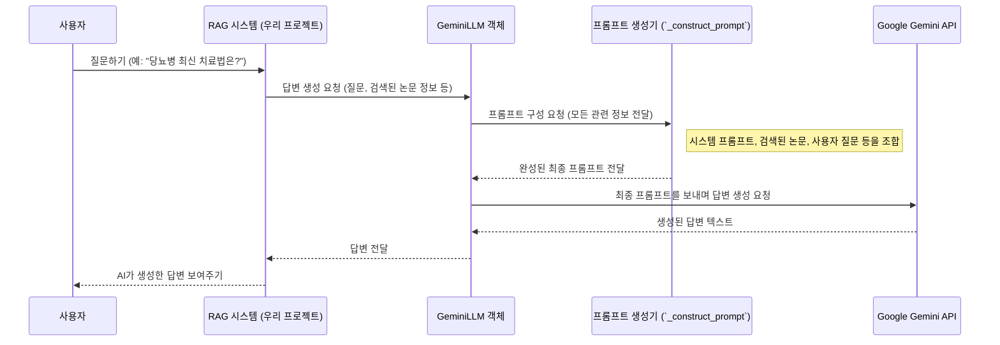

# Chapter 3: 언어 모델 연동 (GeminiLLM)


안녕하세요! 이전 [제2장: 데이터 수집 및 전처리 (스크립트)](02_데이터_수집_및_전처리__스크립트__.md)에서는 우리 프로젝트에 필요한 데이터를 수집하고, Neo4j 데이터베이스에 멋지게 정리하여 저장하는 방법을 배웠습니다. 이제 우리 도서관에는 귀중한 연구 논문 정보들이 가득 찼네요!

하지만 정보가 많다고 해서 항상 좋은 것만은 아니에요. 마치 수백 권의 책이 꽂힌 서재에서 내가 원하는 딱 한 줄의 정보를 찾아내거나, 여러 책의 내용을 종합해서 새로운 결론을 내는 것은 여전히 어려운 일이죠. 사용자가 "최근 코로나 백신 연구 중에 청소년에게 특히 효과적인 건 어떤 게 있나요?" 라고 질문했을 때, 단순히 관련 논문 목록만 보여주는 것보다, 그 논문들을 이해하고 요약해서 친절하게 설명해주는 '똑똑한 비서'가 있다면 얼마나 좋을까요?

이번 장에서는 바로 이 '똑똑한 비서', 즉 우리 프로젝트의 '인공지능 두뇌' 역할을 하는 **구글의 Gemini와 같은 대규모 언어 모델(LLM)을 연동하는 방법**에 대해 알아볼 거예요. 이 인공지능 두뇌는 사용자의 질문 의도를 파악하고, 검색된 정보를 바탕으로 자연스러운 한국어 답변을 생성해주는 핵심적인 역할을 합니다.

## GeminiLLM: 우리 프로젝트의 인공지능 두뇌 🧠

우리 프로젝트에서 `GeminiLLM`은 사용자와의 소통을 담당하는 핵심 요소입니다. 어려운 학술 정보를 사용자가 이해하기 쉬운 답변으로 변환하고, 필요에 따라 정보를 요약하거나 재구성하는 역할을 하죠.

### 대규모 언어 모델(LLM)이란 무엇일까요?

대규모 언어 모델(Large Language Model, LLM)은 아주 아주 많은 텍스트 데이터를 학습해서, 사람처럼 글을 이해하고 생성할 수 있는 인공지능 모델이에요. 마치 수십만 권의 책을 읽고 글쓰기 연습을 엄청나게 많이 한 학생과 같다고 생각할 수 있어요. 이 학생은 새로운 질문을 받으면 자신이 읽었던 책들의 내용을 바탕으로 논리적이고 자연스러운 답변을 만들어낼 수 있죠. 구글의 "Gemini"나 OpenAI의 "GPT" 시리즈가 바로 이런 LLM의 대표적인 예입니다.

### 우리 프로젝트에서 GeminiLLM의 역할

`SKN10-4th-1Team` 프로젝트에서 `GeminiLLM`은 다음과 같은 중요한 일들을 수행합니다:

1.  **사용자 질문 이해**: 사용자가 자연스러운 문장으로 질문해도 그 의도를 정확히 파악합니다. (예: "당뇨병 치료에 좋은 최신 약물 좀 알려줘.")
2.  **정보 요약 및 재구성**: [데이터 수집 및 전처리 (스크립트)](02_데이터_수집_및_전처리__스크립트__.md)를 통해 수집되고 [벡터/그래프 검색 저장소 (Neo4jVectorSearch)](04_벡터_그래프_검색_저장소__neo4jvectorsearch__.md)를 통해 검색된 여러 논문의 핵심 내용을 간추리거나, 서로 다른 정보를 논리적으로 연결하여 종합적인 설명을 제공합니다.
3.  **자연스러운 한국어 답변 생성**: 전문적인 학술 용어나 복잡한 내용을 사용자가 이해하기 쉽게 풀어서, 마치 전문가와 대화하는 것처럼 친절한 한국어 답변을 만들어냅니다.
4.  **문맥 유지 대화**: 이전 대화 내용을 기억하여 이어지는 질문에도 문맥에 맞는 답변을 제공할 수 있습니다.

간단히 말해, `GeminiLLM`은 우리가 모아둔 데이터를 바탕으로 사용자와 지적인 대화를 나눌 수 있게 해주는 '소통 전문가'인 셈입니다.

## GeminiLLM 사용법: 똑똑한 비서에게 일 시키기 (`rag_pipeline/llm.py`)

이제 실제로 우리 프로젝트에서 `GeminiLLM`을 어떻게 사용하는지 코드를 통해 살펴보겠습니다. `rag_pipeline/llm.py` 파일에 그 비밀이 담겨 있답니다.

### 준비물: Gemini API 키 🔑

Gemini 같은 강력한 LLM을 사용하려면, 해당 서비스를 제공하는 회사(여기서는 구글)로부터 사용 허가를 받아야 해요. 이때 필요한 것이 바로 **API 키(API Key)**입니다. API 키는 마치 서비스에 접속할 수 있는 비밀번호와 같아요.

우리 프로젝트에서는 `.env` 파일에 이 API 키를 안전하게 보관하고, 필요할 때 불러와 사용합니다.

```python
# rag_pipeline/llm.py 파일 상단
import os
from dotenv import load_dotenv
import google.generativeai as genai # 구글 Gemini 라이브러리

# .env 파일에서 환경 변수 로드
load_dotenv()

# 환경 변수에서 Gemini API 키 가져오기
GEMINI_API_KEY = os.getenv("GEMINI_API_KEY")
if not GEMINI_API_KEY:
    # API 키가 없으면 오류 발생
    raise ValueError("GEMINI_API_KEY가 설정되지 않았습니다. .env 파일에 GEMINI_API_KEY를 추가해주세요.")

# Gemini AI 사용을 위한 설정
genai.configure(api_key=GEMINI_API_KEY)
```
*   `load_dotenv()`: `.env` 파일에 저장된 `GEMINI_API_KEY=여러분의_API_키`와 같은 설정을 읽어옵니다.
*   `os.getenv("GEMINI_API_KEY")`: 읽어온 값 중에서 `GEMINI_API_KEY`를 찾아 변수에 저장합니다.
*   `genai.configure(...)`: 구글 Gemini 라이브러리가 우리 API 키를 사용해 서비스에 접속할 수 있도록 설정합니다.

**중요**: API 키는 개인 정보와 같으므로, 절대로 코드나 공개된 장소에 직접 작성하지 말고 `.env` 파일을 사용해 관리해야 합니다!

### `GeminiLLM` 클래스: 비서 소환하기 🧙

API 키 설정이 끝났다면, 이제 `GeminiLLM` 클래스를 통해 우리만의 AI 비서를 만들어볼 차례입니다.

```python
# rag_pipeline/llm.py (GeminiLLM 클래스 정의 일부)
class GeminiLLM:
    """Gemini LLM 클라이언트"""
    
    def __init__(self, model_name="gemini-1.5-flash"):
        """
        Gemini LLM 초기화
        
        Args:
            model_name: 사용할 Gemini 모델 이름
        """
        self.model_name = model_name
        # 지정된 모델로 Gemini 모델 객체 생성
        self.model = genai.GenerativeModel(model_name=model_name)
        
        # LLM에게 역할을 부여하는 기본 지침 (시스템 프롬프트)
        self.system_prompt = """
당신은 의학 연구 논문을 검색하고 질문에 답변하는 전문가 AI입니다. 
제공된 논문 정보와 그래프 데이터를 기반으로 정확하고 유용한 답변을 제공하세요.
답변은 항상 한국어로 제공해주세요.

답변 시 반드시 제공된 출처 정보(PMID, 제목, 저자 등)를 인용하고, 각 정보가 어떤 논문에서 나왔는지 명확히 해주세요.
사실 확인이 불가능한 내용은 추측이라고 명시하고, 검색된 정보에서 직접 확인할 수 있는 내용만 포함해주세요.

논문 간의 관계(공통 저자, 키워드 등)가 있다면 이를 강조하여 설명해주세요.
"""
```
*   `__init__` 메서드는 `GeminiLLM` 객체가 처음 만들어질 때 실행되는 '준비 과정'입니다.
*   `model_name="gemini-1.5-flash"`: 어떤 버전의 Gemini 모델을 사용할지 지정합니다. "gemini-1.5-flash"는 비교적 빠르고 효율적인 모델입니다.
*   `self.model = genai.GenerativeModel(...)`: 실제로 Gemini API와 통신할 모델 객체를 만듭니다.
*   `self.system_prompt`: 이 부분이 아주 중요해요! AI 비서에게 "당신은 이런 역할을 해야 하고, 이런 식으로 답변해야 합니다"라고 기본 규칙과 정체성을 알려주는 '지시사항'입니다. 우리 프로젝트에서는 의학 논문 전문가로서, 한국어로, 출처를 밝히며 답변하도록 설정되어 있습니다.

### 답변 생성 요청하기 (`generate_response` 메서드) 🗣️

AI 비서가 준비되었다면, 이제 사용자 질문과 관련 정보를 전달하고 답변을 만들어 달라고 요청할 수 있습니다. `generate_response` 메서드가 바로 이 역할을 합니다.

```python
# GeminiLLM 객체 생성 (예시)
# llm_instance = GeminiLLM()

# 사용자 질문
# user_query = "코로나19 백신의 최신 연구 동향은 어떤가요?"

# 검색 시스템을 통해 찾은 관련 논문 목록 (이전 단계에서 준비됨)
# retrieved_docs = [
#    {"pmid": "12345", "title": "코로나 백신 효과 연구 논문 제목", "abstract": "이 논문은 코로나 백신의 효과를 다룹니다..."},
#    {"pmid": "67890", "title": "새로운 변이에 대한 백신 효능", "abstract": "최신 변이에 대한 백신 효능은..."}
# ]

# 답변 생성 요청!
# response_text = llm_instance.generate_response(
#    query=user_query, 
#    retrieved_docs=retrieved_docs
# )

# AI가 생성한 답변 출력
# print(response_text) 
```
위 예시 코드(실제로는 `rag_pipeline/llm.py` 내에서 호출됨)처럼 `generate_response` 메서드에 사용자의 질문(`query`)과 검색된 논문 정보(`retrieved_docs`)를 전달하면, Gemini 모델이 이 정보들을 바탕으로 답변을 생성하여 `response_text`로 돌려줍니다. 이 텍스트가 바로 사용자에게 보여질 최종 답변이 됩니다.

메서드의 실제 정의는 다음과 같습니다. (일부 인자는 생략)

```python
# rag_pipeline/llm.py (generate_response 메서드 일부)
    def generate_response(self, 
                         query: str, 
                         retrieved_docs: List[Dict[str, Any]], 
                         # ... 다른 필요한 정보들 (related_info, connections 등) ...
                         ) -> str:
        if not retrieved_docs: # 검색된 정보가 없으면
            return "검색된 정보가 없어 답변을 생성할 수 없습니다."
        
        # LLM에게 전달할 프롬프트(지시문) 구성
        prompt = self._construct_prompt(query, retrieved_docs, ...) # 아래에서 자세히 설명
        
        try:
            # Gemini 모델에게 프롬프트를 전달하고 응답 생성 요청
            response = self.model.generate_content(prompt)
            return response.text # 생성된 텍스트 답변 반환
        except Exception as e:
            print(f"응답 생성 오류: {e}")
            return "응답 생성 중 오류가 발생했습니다."
```
만약 검색된 문서가 없다면 답변 생성이 불가능하다는 메시지를 반환하고, 그렇지 않으면 `_construct_prompt`라는 특별한 메서드를 호출하여 LLM에게 전달할 상세한 '지시문(프롬프트)'을 만듭니다. 이 프롬프트를 Gemini 모델에 보내면, 모델이 답변을 생성해 돌려줍니다.

## `GeminiLLM`은 어떻게 답변을 만들까요? (내부 작동 원리) 🛠️

`GeminiLLM`이 단순히 질문만 받고 뚝딱 답변을 만들어내는 것은 아니에요. 마치 똑똑한 비서가 보고서를 작성하기 전에 관련 자료를 꼼꼼히 검토하고 정리하는 것처럼, LLM도 답변을 생성하기 전에 체계적인 준비 과정을 거칩니다.

### 1단계: 비서에게 필요한 모든 정보 전달하기 (`_construct_prompt` 메서드) 📝

`_construct_prompt` 메서드는 LLM이 최상의 답변을 생성할 수 있도록 '맞춤형 정보 패키지'를 만드는 역할을 합니다. 이 정보 패키지를 **프롬프트(prompt)**라고 부르며, 여기에는 다음과 같은 내용들이 포함됩니다.

1.  **시스템 프롬프트 (System Prompt)**: `__init__`에서 정의한 AI의 기본 역할과 지침 (예: "당신은 의학 논문 전문가 AI입니다...")
2.  **이전 대화 기록 (Chat History)**: (만약 있다면) 사용자와 이전에 나눴던 대화 내용. 이를 통해 AI는 대화의 맥락을 이해하고 더 자연스러운 답변을 할 수 있습니다.
3.  **검색된 논문 정보 (Retrieved Docs)**: 사용자의 질문과 관련하여 [벡터/그래프 검색 저장소 (Neo4jVectorSearch)](04_벡터_그래프_검색_저장소__neo4jvectorsearch__.md)를 통해 찾은 논문들의 목록입니다. 각 논문의 PMID(고유번호), 제목, 초록(요약), 질문과의 유사도 등이 포함됩니다.
    ```python
    # rag_pipeline/llm.py (_construct_prompt 메서드에서 논문 정보 추가하는 부분 예시)
    # prompt += "### 검색된 논문 정보:\n"
    # for i, doc in enumerate(retrieved_docs):
    #     prompt += f"[논문 {i+1}] PMID: {doc.get('pmid')}\n"
    #     prompt += f"제목: {doc.get('title')}\n"
    #     abstract = doc.get('abstract', '')
    #     if len(abstract) > 1000: # 초록이 너무 길면 일부만 사용
    #         abstract = abstract[:1000] + "..."
    #     prompt += f"초록: {abstract}\n\n"
    ```
4.  **특정 논문의 관련 정보 (Related Info)**: 사용자가 특정 논문에 대해 더 자세히 알고 싶어할 경우, 해당 논문의 저자, 키워드, 실린 학술지 등의 상세 정보를 추가합니다. 이 정보는 [그래프 데이터 모델 (Neo4j 모델)](01_그래프_데이터_모델__neo4j_모델__.md)에서 정의한 관계를 통해 가져옵니다.
5.  **논문 간 연결 관계 (Connections & Graph Context)**: 검색된 논문들이 서로 어떻게 연결되어 있는지 (예: 공통 저자, 동일 키워드 사용 등) 그래프 데이터베이스에서 분석한 정보를 제공합니다. 이 정보는 답변을 더욱 풍부하고 깊이 있게 만들어줍니다. 이 부분은 [RAG 파이프라인 (HybridGraphFlow)](05_rag_파이프라인__hybridgraphflow__.md)에서 더 자세히 다뤄집니다.
6.  **사용자 질문 (User Query)**: 마지막으로 사용자가 실제로 한 질문을 명확하게 전달합니다.

이렇게 모든 정보를 하나로 합쳐 LLM에게 전달할 긴 텍스트 프롬프트를 완성합니다.

### 2단계: Gemini 모델에게 답변 생성 요청하기 💬➡️🤖

잘 만들어진 프롬프트는 `self.model.generate_content(prompt)` 코드를 통해 Gemini API로 전송됩니다. Gemini 모델은 이 프롬프트 내용을 꼼꼼히 읽고 분석한 후, 지시사항에 맞춰 가장 적절하다고 판단되는 답변을 생성합니다.

### 3단계: 결과 돌려주기 🤖➡️🗣️

Gemini 모델이 생성한 답변은 `response.text` 형태로 우리 코드에 돌아오고, 이 내용이 사용자에게 최종적으로 전달됩니다.

이 전체 과정을 간단한 순서도로 표현하면 다음과 같습니다:



### `_construct_prompt` 자세히 들여다보기: LLM을 위한 맞춤 정보 패키지 🎁

앞서 설명했듯이 `_construct_prompt` 메서드는 Gemini가 똑똑한 답변을 할 수 있도록 '재료'를 준비하는 매우 중요한 과정입니다. 시스템 프롬프트, 이전 대화, 검색된 문서, 관련 정보, 그래프 연결 정보, 그리고 사용자 질문을 순서대로 차곡차곡 쌓아 하나의 긴 지시문을 만듭니다.

예를 들어, 특정 논문의 저자 정보를 프롬프트에 추가하는 부분은 다음과 같을 수 있습니다:

```python
# rag_pipeline/llm.py (_construct_prompt 메서드 중 저자 정보 부분 예시)
# if related_info and related_info.get('authors'): # 관련 정보와 저자 정보가 있다면
#     prompt += "### 특정 논문의 저자 정보:\n"
#     for author in related_info.get('authors')[:5]:  # 최대 5명까지 표시
#         prompt += f"- {author.get('full_name')}"
#         if author.get('affiliation'): # 소속 정보가 있다면 함께 표시
#             prompt += f" ({author.get('affiliation')})"
#         prompt += "\n"
```
이처럼 각 정보 유형에 맞춰 적절한 형식으로 프롬프트에 추가함으로써, LLM이 각 정보의 의미와 중요도를 더 잘 파악하도록 돕습니다. 마지막에는 "위 정보를 바탕으로 사용자의 질문에 한국어로 상세히 답변해주세요."와 같은 명확한 지시를 추가하여 LLM이 최종적으로 수행해야 할 작업을 알려줍니다.

## 우리 프로젝트에서 GeminiLLM의 특별한 점 ✨

`GeminiLLM`을 사용하는 것은 단순히 일반적인 챗봇을 만드는 것과는 다릅니다. 우리 프로젝트의 `GeminiLLM`은 다음과 같은 특별한 점들이 있습니다:

*   **의학 연구 분야 특화**: 시스템 프롬프트를 통해 AI가 의학 연구 논문 전문가로서 행동하도록 설정했습니다.
*   **그래프 데이터 활용**: [그래프 데이터 모델 (Neo4j 모델)](01_그래프_데이터_모델__neo4j_모델__.md)에 저장된 논문, 저자, 키워드 간의 관계 정보를 활용하여 답변의 깊이와 풍부함을 더합니다. 예를 들어, "이 두 논문은 같은 저자가 참여했고, 비슷한 키워드를 다루고 있습니다." 와 같은 분석적인 내용도 제공할 수 있습니다.
*   **출처 기반 답변**: 환각(hallucination, AI가 사실이 아닌 내용을 지어내는 현상)을 최소화하고 신뢰도를 높이기 위해, 반드시 제공된 논문 정보를 근거로 답변하도록 지시합니다.

## 정리하며 📚

이번 장에서는 우리 프로젝트의 '인공지능 두뇌'인 `GeminiLLM`에 대해 자세히 알아보았습니다.

*   대규모 언어 모델(LLM)이 무엇이며, 우리 프로젝트에서 어떤 중요한 역할을 하는지 이해했습니다.
*   Gemini API 키를 설정하고, `GeminiLLM` 클래스를 초기화하여 AI 비서를 준비하는 방법을 배웠습니다.
*   사용자 질문과 검색된 정보를 `GeminiLLM`에 전달하여 자연스러운 한국어 답변을 생성하는 과정을 살펴보았습니다.
*   특히 `_construct_prompt` 메서드가 시스템 프롬프트, 검색 결과, 관련 정보, 사용자 질문 등을 조합하여 LLM에게 최적의 '정보 패키지(프롬프트)'를 만드는 핵심 과정임을 알게 되었습니다.

이제 우리에게는 데이터를 저장하는 훌륭한 도서관([Neo4j](01_그래프_데이터_모델__neo4j_모델__.md), [데이터 수집](02_데이터_수집_및_전처리__스크립트__.md))과 그 내용을 이해하고 설명해줄 똑똑한 비서(`GeminiLLM`)가 모두 준비되었습니다! 하지만 비서에게 정확한 자료를 찾아주지 못한다면 비서도 제대로 일할 수 없겠죠?

다음 장에서는 이 똑똑한 비서에게 전달할 '정확한 자료'를 우리 데이터베이스에서 얼마나 효율적으로 찾아낼 수 있는지, 즉 **벡터 검색과 그래프 검색을 결합한 하이브리드 검색 방법**에 대해 자세히 알아보겠습니다.

바로 [제4장: 벡터/그래프 검색 저장소 (Neo4jVectorSearch)](04_벡터_그래프_검색_저장소__neo4jvectorsearch__.md)에서 만나요!

---

Generated by [AI Codebase Knowledge Builder](https://github.com/The-Pocket/Tutorial-Codebase-Knowledge)
