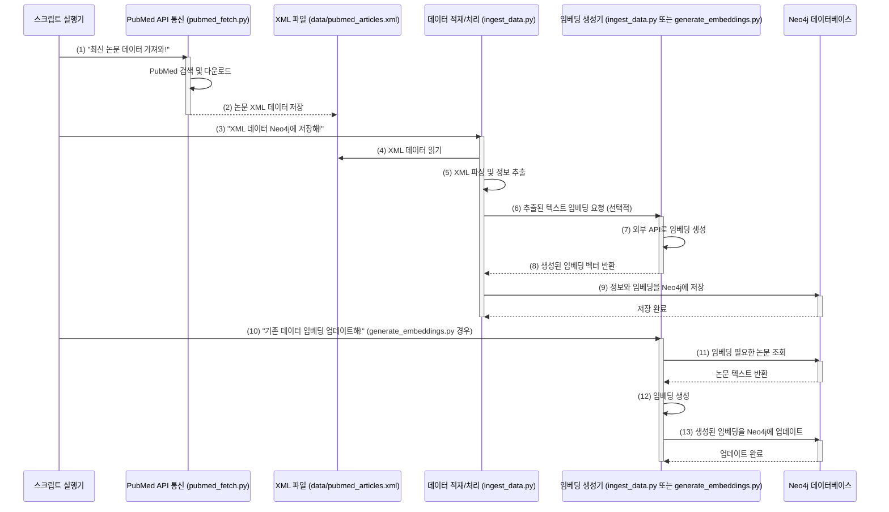

# Chapter 4: 데이터 수집 및 전처리 스크립트

안녕하세요! `SKN10-4th-1Team` 프로젝트 튜토리얼의 네 번째 장에 오신 것을 환영합니다. 지난 [Chapter 3: Neo4j 데이터 모델 및 연동](03_neo4j_데이터_모델_및_연동_.md)에서는 우리 시스템의 연구 데이터들이 Neo4j 그래프 데이터베이스에 어떤 구조로 저장되고, 시스템이 이 데이터베이스와 어떻게 상호작용하는지 알아보았습니다. 잘 설계된 데이터베이스도 결국은 그 안에 채워질 알찬 데이터가 있어야 빛을 발하겠죠?

이번 장에서는 우리 RAG 시스템이 똑똑하게 답변하는 데 필요한 지식, 즉 **논문 데이터를 준비하는 과정**을 담당하는 "데이터 수집 및 전처리 스크립트"에 대해 자세히 알아볼 거예요. 마치 도서관에 새로 들어올 책들을 선정해서 가져오고, 각 책의 내용을 쉽게 찾아볼 수 있도록 정리하고 색인을 만드는 작업과 같답니다!

## 똑똑한 RAG 시스템의 첫걸음: 왜 데이터 수집과 전처리가 필요할까요?

우리가 만들고 있는 의학 논문 RAG 시스템이 사용자에게 정확하고 유용한 답변을 하려면, 가장 먼저 방대한 의학 논문 지식을 갖추고 있어야 합니다. 예를 들어, 사용자가 "최근 코로나19 백신 연구 동향은 어떤가요?"라고 질문했을 때, 시스템은 관련 최신 논문들을 이미 알고 있어야 답변을 생성할 수 있겠죠.

바로 이 "지식"을 시스템에 넣어주는 과정이 **데이터 수집 및 전처리**입니다. 이 과정이 없다면 우리 시스템은 아무것도 모르는 빈 껍데기와 같아요. 데이터 수집 및 전처리 스크립트들은 다음과 같은 중요한 역할을 합니다:

1.  **데이터 가져오기 (수집)**: 외부 데이터베이스(우리 프로젝트에서는 주로 PubMed)에서 필요한 논문 데이터를 가져옵니다.
2.  **데이터 정리하기 (파싱 및 정제)**: 가져온 원본 데이터(주로 XML 형식)는 바로 사용하기 어렵습니다. 이 데이터를 분석해서 제목, 초록, 저자, 출판일, 키워드 등 필요한 정보만 쏙쏙 뽑아냅니다.
3.  **데이터 구조화하기 (변환 및 저장)**: 뽑아낸 정보들을 [Chapter 3: Neo4j 데이터 모델 및 연동](03_neo4j_데이터_모델_및_연동_.md)에서 설계한 Neo4j 데이터 모델에 맞게 변환하여 그래프 데이터베이스에 저장합니다. 이렇게 해야 나중에 정보들 간의 관계를 쉽게 탐색할 수 있습니다.
4.  **의미 기반 검색 준비 (임베딩 생성)**: 논문의 제목이나 초록 같은 텍스트 정보를 컴퓨터가 이해할 수 있는 숫자들의 배열(벡터 임베딩)로 변환합니다. 이 임베딩 덕분에 단순히 키워드가 일치하는 것을 넘어, 의미적으로 유사한 내용을 검색할 수 있게 됩니다. ([Chapter 2: 하이브리드 RAG 파이프라인](02_하이브리드_rag_파이프라인_.md)에서 중요하게 활용되죠!)

이 모든 과정을 자동화하는 스크립트 덕분에 우리 RAG 시스템은 지속적으로 새로운 지식을 학습하고 최신 정보를 유지할 수 있습니다.

## 데이터 준비 대작전: 주요 스크립트와 역할 살펴보기

우리 프로젝트에서는 주로 `scripts` 폴더 안에 있는 파이썬 스크립트들이 이 데이터 준비 대작전을 수행합니다. 각 스크립트가 어떤 임무를 맡고 있는지 알아볼까요?

### 1. 논문 데이터 사냥꾼: `scripts/pubmed_fetch.py`

이 스크립트는 PubMed와 같은 외부 의학 논문 데이터베이스에서 특정 조건(예: 특정 키워드, 최신 논문)에 맞는 논문 정보를 가져오는 역할을 합니다. 마치 도서관 사서가 새로 들여올 책 목록을 정하고 주문하는 것과 같아요.

*   **핵심 기능**:
    *   PubMed에 특정 검색어로 질의하여 논문 ID(PMID) 목록을 가져옵니다.
    *   가져온 PMID 목록을 바탕으로 각 논문의 상세 정보(XML 형식)를 다운로드합니다.
    *   다운로드한 XML 데이터를 파일로 저장합니다. (예: `data/pubmed_articles.xml`)

**코드 맛보기:** `Entrez` 라이브러리를 사용하여 PubMed에서 특정 검색어("covid 19")로 논문 ID를 검색하는 부분입니다.

```python
# scripts/pubmed_fetch.py 일부
from Bio import Entrez

Entrez.email = "여러분의이메일@example.com" # NCBI 사용을 위해 이메일 설정

def search_recent_pubmed_ids(query="covid 19", count=10):
    # PubMed 데이터베이스에서 'query'로 검색하여 'count'만큼 ID 가져오기
    handle = Entrez.esearch(db="pubmed", term=query, retmax=str(count))
    record = Entrez.read(handle)
    handle.close()
    return record["IdList"]

# pmids = search_recent_pubmed_ids()
# print(f"가져온 PMID 개수: {len(pmids)}")
```
위 코드에서 `Entrez.esearch` 함수는 PubMed에 "코로나19 관련 논문을 최신순으로 10개 찾아줘!" 와 같은 요청을 보내고, 그 결과로 논문 고유 ID 목록을 받습니다. 이렇게 얻은 ID들을 이용해 `Entrez.efetch` 함수로 각 논문의 상세 XML 데이터를 가져오게 됩니다.

### 2. 데이터 요리사: `scripts/ingest_data.py`

`pubmed_fetch.py`가 사냥해 온 날것의 데이터(XML 파일)를 맛있게 요리하여 우리 시스템이 잘 소화할 수 있도록 만드는 요리사 역할을 합니다.

*   **핵심 기능**:
    *   `pubmed_fetch.py`가 저장한 XML 파일을 읽어들입니다.
    *   XML 데이터를 한 줄 한 줄 분석(파싱)하여 논문의 제목, 초록, 저자, 출판 연도, 저널, 키워드 등의 정보를 추출합니다.
    *   추출된 정보를 [Chapter 3: Neo4j 데이터 모델 및 연동](03_neo4j_데이터_모델_및_연동_.md)에서 정의한 `Article`, `Author`, `Keyword` 등의 `neomodel` 객체로 변환합니다.
    *   변환된 객체들을 Neo4j 데이터베이스에 노드와 관계로 저장합니다.
    *   (선택 사항) 저장 과정에서 논문의 텍스트 정보(제목, 초록)에 대한 임베딩 벡터를 생성하여 함께 저장합니다.

**코드 맛보기 (XML 파싱):** `xml.etree.ElementTree`를 사용하여 XML 파일에서 논문 제목을 추출하는 간단한 예시입니다.

```python
# scripts/ingest_data.py 의 parse_pubmed_xml 함수 일부 (간략화)
import xml.etree.ElementTree as ET

def parse_single_article_xml(article_element_string): # 실제로는 파일에서 읽어옴
    root = ET.fromstring(article_element_string) # 문자열로부터 XML 요소 생성
    # MedlineCitation -> Article -> ArticleTitle 경로에서 제목 텍스트 찾기
    title_element = root.find('.//MedlineCitation//Article//ArticleTitle')
    title = title_element.text if title_element is not None else "제목 없음"
    return title

# 예시 XML 문자열 (실제로는 파일에서 PubmedArticle 요소를 읽어옴)
# sample_xml = "<PubmedArticle><MedlineCitation><Article><ArticleTitle>코로나 연구</ArticleTitle></Article></MedlineCitation></PubmedArticle>"
# print(f"추출된 제목: {parse_single_article_xml(sample_xml)}")
```
실제 `parse_pubmed_xml` 함수는 이보다 훨씬 복잡하게 다양한 정보들을 추출합니다.

**코드 맛보기 (Neo4j에 저장):** 추출된 정보를 바탕으로 `Article` 노드를 만들고 저장하는 부분입니다.

```python
# scripts/ingest_data.py 의 ingest_data_to_neo4j 함수 일부 (간략화)
from api.models import Article # 우리가 정의한 Article 모델

def save_article_to_neo4j(pmid_val, title_val, abstract_val):
    # Article 모델 객체 생성
    article_node = Article(pmid=pmid_val, title=title_val, abstract=abstract_val)
    # 여기에 임베딩 생성 및 할당 로직 추가 가능
    # article_node.combined_embedding = create_embedding(title_val + " " + abstract_val)
    article_node.save() # Neo4j 데이터베이스에 저장!
    print(f"'{title_val}' 논문 저장 완료 (PMID: {pmid_val})")

# save_article_to_neo4j("12345", "새로운 백신 연구", "이 연구는...")
```
이처럼 `neomodel`을 사용하면 파이썬 객체를 다루듯이 쉽게 Neo4j에 데이터를 저장하고 관계를 맺을 수 있습니다. 예를 들어, `Author` 노드를 만들고 `article_node.authors.connect(author_node)` 와 같이 논문과 저자를 연결할 수 있습니다.

### 3. 의미 번역가: `scripts/generate_embeddings.py` (또는 `ingest_data.py` 내 통합)

이 스크립트(또는 기능)는 논문의 텍스트 정보(주로 제목과 초록)를 컴퓨터가 이해하고 비교할 수 있는 숫자들의 긴 목록, 즉 **벡터 임베딩**으로 변환하는 중요한 역할을 합니다. 마치 한국어를 영어로 번역하듯, 사람의 언어를 기계의 언어로 바꿔주는 셈이죠.

*   **핵심 기능**:
    *   Neo4j 데이터베이스에서 아직 임베딩이 생성되지 않은 논문들을 가져옵니다.
    *   각 논문의 제목, 초록 등의 텍스트를 OpenAI 같은 외부 LLM 서비스의 임베딩 API에 전달합니다.
    *   API로부터 받은 임베딩 벡터를 해당 논문 노드의 속성(예: `combined_embedding`)에 저장합니다.

`ingest_data.py` 스크립트 내에 `create_embedding` 함수가 포함되어 데이터 적재 시점에 임베딩을 생성할 수도 있고, `scripts/generate_embeddings.py` 스크립트를 사용하여 이미 적재된 데이터에 대해 일괄적으로 임베딩을 생성하거나 업데이트할 수도 있습니다.

**코드 맛보기:** `OpenAI` 라이브러리를 사용하여 텍스트에 대한 임베딩을 생성하는 부분입니다.

```python
# scripts/generate_embeddings.py 또는 ingest_data.py 내의 create_embedding 함수 (간략화)
from openai import OpenAI
import os

# OPENAI_API_KEY = os.getenv('OPENAI_API_KEY') # 환경 변수에서 API 키 로드
# client = OpenAI(api_key=OPENAI_API_KEY)

def create_text_embedding(text_to_embed):
    if not text_to_embed: return None
    # client = OpenAI(api_key="YOUR_API_KEY") # 실제 사용시 API 키 설정
    # response = client.embeddings.create(
    #     input=text_to_embed,
    #     model="text-embedding-3-large" # 사용할 임베딩 모델
    # )
    # return response.data[0].embedding
    return [0.1, 0.2, -0.05] # 실제로는 API 응답인 긴 숫자 배열 (예시)

# sample_text = "코로나 바이러스 연구 동향"
# embedding_vector = create_text_embedding(sample_text)
# print(f"생성된 임베딩 (일부): {embedding_vector[:3]}...")
```
이렇게 생성된 임베딩 벡터는 `Article` 노드의 `title_embedding`, `abstract_embedding`, `combined_embedding` 같은 `JSONProperty` 필드에 저장됩니다 (이는 `api/models.py`에 정의되어 있습니다).

## 데이터 파이프라인: 스크립트 실행 흐름 한눈에 보기

이 스크립트들이 실제로 어떻게 함께 작동하여 데이터를 준비하는지 전체 흐름을 그림으로 살펴봅시다.



1.  **(1-2) 데이터 수집**: `pubmed_fetch.py` 스크립트가 실행되어 PubMed에서 논문 데이터를 가져와 XML 파일로 저장합니다.
2.  **(3-9) 데이터 적재 및 초기 임베딩**: `ingest_data.py` 스크립트가 실행되어 XML 파일을 읽고, 내용을 파싱하여 필요한 정보를 추출합니다. 추출된 정보는 Neo4j 데이터 모델에 맞춰 변환되고, 이 과정에서 텍스트 데이터에 대한 임베딩이 생성되어 함께 Neo4j에 저장됩니다.
3.  **(10-13) 임베딩 생성/업데이트 (별도 실행 시)**: `generate_embeddings.py` 스크립트는 이미 Neo4j에 저장된 데이터 중 임베딩이 없거나 업데이트가 필요한 경우를 대상으로 임베딩을 생성하여 데이터베이스를 최신 상태로 유지합니다.

이러한 파이프라인을 통해 우리 시스템은 항상 최신의, 그리고 잘 정리된 지식 기반을 갖추게 됩니다!

## 스크립트 실행하기: 직접 데이터 준비해보기

이 스크립트들은 보통 터미널(명령 프롬프트)에서 파이썬 명령어로 실행합니다.

1.  **PubMed 데이터 가져오기:**
    ```bash
    python scripts/pubmed_fetch.py
    ```
    이 명령을 실행하면 `ENTREZ_EMAIL` 환경 변수 설정 및 `Bio.Entrez` 라이브러리가 필요하며, 스크립트 내에 정의된 검색 조건에 따라 `data/pubmed_articles.xml` 파일이 생성되거나 업데이트됩니다.

2.  **XML 데이터를 Neo4j에 적재하고 임베딩 생성하기:**
    ```bash
    python scripts/ingest_data.py
    ```
    이 명령을 실행하면 `data/pubmed_articles.xml` 파일을 읽어 Neo4j 데이터베이스에 연결하고, 논문, 저자, 키워드 등의 노드와 관계를 생성합니다. `USE_EMBEDDINGS=True` 및 `OPENAI_API_KEY` 환경 변수가 설정되어 있다면, 데이터 적재 시 임베딩도 함께 생성되어 저장됩니다. `api/models.py`에서 Neo4j 연결 (`NEO4J_BOLT_URL`)이 올바르게 설정되어 있어야 합니다.

3.  **(선택적) 기존 데이터에 대한 임베딩 일괄 생성/업데이트:**
    ```bash
    python scripts/generate_embeddings.py
    ```
    이 스크립트를 실행하면 사용자에게 몇 가지 옵션(예: 모든 Article에 대해 생성, 특정 PMID에 대해 생성)을 묻고, 선택에 따라 Neo4j에 있는 데이터의 임베딩을 생성하거나 업데이트합니다. `OPENAI_API_KEY` 환경 변수 설정이 필요합니다.

**주의사항**:
*   스크립트 실행 전에 필요한 라이브러리들(`biopython`, `openai`, `python-dotenv`, `neomodel` 등)이 설치되어 있어야 합니다. (보통 `requirements.txt` 파일을 통해 설치)
*   `.env` 파일에 `NEO4J_BOLT_URL`, `ENTREZ_EMAIL`, `OPENAI_API_KEY` 등의 환경 변수가 올바르게 설정되어 있는지 확인해야 합니다.
*   Neo4j 데이터베이스 서버가 실행 중이어야 `ingest_data.py`와 `generate_embeddings.py` 스크립트가 정상적으로 작동합니다.

## 정리하며

이번 장에서는 우리 RAG 시스템의 지식 창고를 채우는 핵심 과정인 **데이터 수집 및 전처리 스크립트**에 대해 알아보았습니다. `pubmed_fetch.py`를 통해 외부에서 논문 데이터를 가져오고, `ingest_data.py`를 통해 이 데이터를 분석하고 구조화하여 [Chapter 3: Neo4j 데이터 모델 및 연동](03_neo4j_데이터_모델_및_연동_.md)에서 배운 Neo4j 데이터베이스에 저장하는 방법을 살펴보았습니다. 또한, 의미 기반 검색을 위해 `generate_embeddings.py` (또는 `ingest_data.py` 내 기능)를 사용하여 텍스트 데이터로부터 임베딩을 생성하고 저장하는 과정도 이해했습니다.

이러한 자동화된 스크립트 덕분에 우리 시스템은 방대한 양의 의학 논문 정보를 효과적으로 관리하고 활용할 수 있는 강력한 기반을 갖추게 됩니다. 잘 준비된 데이터는 똑똑한 RAG 시스템의 시작이니까요!

자, 이제 우리 시스템은 풍부한 지식을 갖추게 되었습니다. 다음 장에서는 사용자가 이 지식을 어떻게 쉽고 편리하게 탐색하고 질문할 수 있는지, 그 창구가 되어줄 [Chapter 5: 사용자 인터페이스 (챗봇 및 정보 패널)](05_사용자_인터페이스__챗봇_및_정보_패널__.md)에 대해 자세히 알아보겠습니다. 사용자와 시스템이 만나는 흥미진진한 여정을 기대해주세요!

---

Generated by [AI Codebase Knowledge Builder](https://github.com/The-Pocket/Tutorial-Codebase-Knowledge)