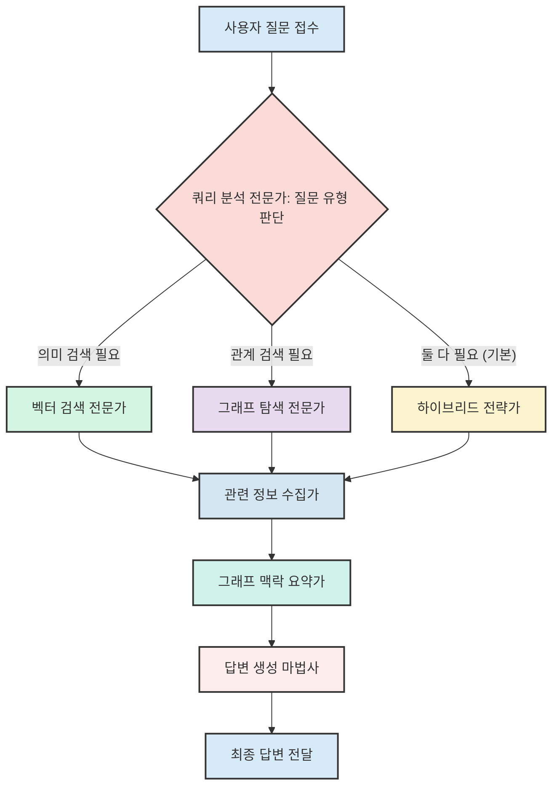

# Chapter 5: RAG 파이프라인 (HybridGraphFlow)


안녕하세요! 이전 [제4장: 벡터/그래프 검색 저장소 (Neo4jVectorSearch)](04_벡터_그래프_검색_저장소__neo4jvectorsearch__.md)에서는 마치 슈퍼 사서처럼 사용자의 질문에 맞는 정보를 콕콕 집어 찾아주는 `Neo4jVectorSearch`에 대해 배웠습니다. 이 똑똑한 사서는 의미로 문서를 찾거나(벡터 검색), 문서들 간의 연결고리(그래프 검색)를 탐색하는 특별한 능력을 가지고 있었죠.

하지만 때로는 사용자의 질문이 단순한 문서 검색을 넘어, 여러 종류의 정보를 종합하고, 질문의 숨은 의도까지 파악해야 하는 복잡한 경우도 있습니다. 예를 들어, "최근 비만 치료 연구 중에 당뇨병 환자에게 특히 주목할 만한 접근법과 관련된 주요 연구자 네트워크는 어떻게 되나요?" 와 같은 질문을 받는다면 어떨까요? 이런 질문에는 단순히 유사한 논문 목록만으로는 충분하지 않겠죠. 질문의 성격에 따라 검색 전략을 바꾸고, 다양한 정보를 유기적으로 결합하여 심층적인 답변을 만들어낼 '전문가 팀'이 필요합니다.

이번 장에서는 바로 이 '전문가 팀'의 역할을 하는 **`HybridGraphFlow`**에 대해 알아볼 거예요. `HybridGraphFlow`는 사용자의 질문을 받아 여러 단계를 거쳐 최적의 답변을 생성하는 전체적인 처리 흐름, 즉 'RAG(Retrieval Augmented Generation, 검색 증강 생성) 파이프라인'입니다. 마치 복잡한 사건을 해결하기 위해 각 분야의 전문가들이 모여 협력하는 탐정 팀과 같답니다!

## `HybridGraphFlow`란 무엇일까요? - 똑똑한 전문가 팀을 만나보세요! 🕵️‍♀️ H

`HybridGraphFlow`는 사용자의 질문을 가장 잘 이해하고, 가장 유용한 답변을 찾아내기 위해 구성된 우리 프로젝트의 '문제 해결 전략 본부'입니다. 이 본부에는 다양한 능력을 가진 전문가들이 모여있어요.

*   **쿼리 분석가**: 사용자의 질문을 꼼꼼히 분석해서 어떤 종류의 정보가 필요한지, 어떤 검색 방법이 가장 효과적일지 판단합니다.
*   **벡터 검색 전문가**: 질문과 의미적으로 가장 유사한 논문들을 찾아냅니다.
*   **그래프 탐색 전문가**: 논문, 저자, 키워드 간의 숨겨진 연결고리를 추적하여 관련 정보를 찾아냅니다.
*   **정보 통합 전략가**: 필요에 따라 벡터 검색 결과와 그래프 검색 결과를 지능적으로 결합합니다.
*   **답변 생성 마법사**: 수집된 모든 정보를 바탕으로, [제3장: 언어 모델 연동 (GeminiLLM)](03_언어_모델_연동__geminillm__.md)의 도움을 받아 사용자에게 가장 이해하기 쉽고 유용한 답변을 만들어냅니다.

이 전문가 팀은 **LangGraph**라는 도구를 사용하여 마치 잘 짜인 시나리오처럼 협력합니다. LangGraph는 각 전문가(처리 단계)를 '노드'로, 정보 전달 과정을 '엣지'로 연결하여 복잡한 작업 흐름을 만들 수 있게 도와주는 라이브러리입니다. 질문의 유형에 따라 어떤 전문가가 먼저 나설지, 어떤 순서로 작업할지가 동적으로 결정되죠.

이 전문가 팀의 전체적인 작업 흐름은 다음과 같이 그려볼 수 있습니다:


이처럼 `HybridGraphFlow`는 사용자의 질문 하나하나에 맞춰 최적의 해결책을 찾아가는 유연하고 강력한 시스템입니다.

## 전문가 팀의 구성원들: 각 단계별 역할 🧑‍🔬

`HybridGraphFlow`는 `rag_pipeline/graph_flow.py` 파일에 정의된 `HybridGraphFlow` 클래스를 통해 구현됩니다. 이 클래스 내부에는 각 전문가의 역할을 수행하는 여러 메서드(함수)들이 있습니다. 이 전문가들은 `QueryState`라는 '공동 작업 노트'에 현재까지의 진행 상황(질문 내용, 검색 결과 등)을 기록하고 다음 전문가에게 전달합니다.

주요 전문가(메서드)들을 살펴볼까요?

1.  **쿼리 분석 전문가 (`_determine_query_type`)**:
    *   **역할**: 사용자의 질문을 가장 먼저 받아, 이 질문의 의도가 무엇인지, 어떤 정보 검색 방식이 가장 적합할지 판단합니다. "코로나 백신 최신 연구 동향 알려줘" 같은 질문은 '벡터 검색'이, "특정 저자의 공동 연구자 목록 보여줘" 같은 질문은 '그래프 검색'이, "A 질병과 관련된 최신 논문들과 주요 연구자 관계도 알려줘" 같은 복합적인 질문은 '하이브리드 검색'이 적합하다고 판단할 수 있습니다.
    *   **도구**: [제3장: 언어 모델 연동 (GeminiLLM)](03_언어_모델_연동__geminillm__.md)을 활용하여 질문의 유형을 "vector", "graph", 또는 "hybrid"로 분류합니다.

2.  **벡터 검색 전문가 (`_vector_search`)**:
    *   **역할**: '쿼리 분석 전문가'가 벡터 검색이 필요하다고 판단하면, 이 전문가가 나섭니다. 사용자의 질문과 의미적으로 가장 유사한 논문들을 찾아옵니다.
    *   **도구**: [제4장: 벡터/그래프 검색 저장소 (Neo4jVectorSearch)](04_벡터_그래프_검색_저장소__neo4jvectorsearch__.md)의 `semantic_search` 기능을 사용합니다.

3.  **그래프 탐색 전문가 (`_graph_search`)**:
    *   **역할**: '쿼리 분석 전문가'가 그래프 검색이 필요하다고 판단하면, 이 전문가가 활동을 시작합니다. 데이터베이스 내의 논문, 저자, 키워드 간의 관계를 탐색하여 사용자가 궁금해하는 연결고리나 네트워크 정보를 찾아냅니다. (현재 코드에서는 예시로 특정 키워드를 포함하는 논문을 찾는 Cypher 쿼리를 사용합니다.)
    *   **도구**: [제4장: 벡터/그래프 검색 저장소 (Neo4jVectorSearch)](04_벡터_그래프_검색_저장소__neo4jvectorsearch__.md)의 Cypher 쿼리 실행 기능을 사용합니다.

4.  **하이브리드 전략가 (`_hybrid_search`)**:
    *   **역할**: 가장 일반적인 경우로, 벡터 검색과 그래프 검색의 장점을 모두 활용합니다. 먼저 벡터 검색으로 관련성이 높은 논문들을 찾고, 그 논문들을 중심으로 그래프 탐색을 추가로 수행하여 더 풍부한 정보를 확보합니다.
    *   **도구**: `Neo4jVectorSearch`의 `semantic_search`와 `find_article_connections` 등을 조합하여 사용합니다.

5.  **관련 정보 수집가 (`_gather_related_nodes`)**:
    *   **역할**: 검색 결과로 나온 주요 논문(들)에 대해 좀 더 자세한 정보를 수집합니다. 예를 들어, 가장 관련성 높은 논문의 저자 목록, 사용된 키워드, 게재된 학술지 정보 등을 가져옵니다.
    *   **도구**: `Neo4jVectorSearch`의 `get_related_nodes` 기능을 사용합니다.

6.  **그래프 맥락 요약가 (`_extract_graph_context`)**:
    *   **역할**: 검색된 여러 논문들 사이의 관계나 특징적인 패턴(예: "이 논문들은 주로 '유전자 치료'라는 공통 키워드를 다루고 있으며, 다수의 논문이 'Journal of Medical Research'에 게재되었습니다.")을 요약하여, '답변 생성 마법사'가 답변을 만들 때 참고할 수 있는 유용한 '그래프 맥락' 정보를 생성합니다.
    *   **도구**: `Neo4jVectorSearch`의 `get_graph_context_for_response` 기능을 사용합니다.

7.  **답변 생성 마법사 (`_generate_response`)**:
    *   **역할**: 모든 전문가들이 수집하고 분석한 정보(검색된 논문, 관련 노드 정보, 그래프 맥락, 사용자 질문, 이전 대화 내용 등)를 종합하여, 사용자에게 자연스럽고 이해하기 쉬운 최종 답변을 생성합니다.
    *   **도구**: [제3장: 언어 모델 연동 (GeminiLLM)](03_언어_모델_연동__geminillm__.md)의 `generate_response` 기능을 사용합니다.

이 모든 전문가들이 각자의 역할을 마치면, 그 결과는 `QueryState`라는 '공동 작업 노트'에 차곡차곡 쌓이게 됩니다.

```python
# rag_pipeline/graph_flow.py (QueryState 정의 일부)
from typing import List, Dict, Any, TypedDict

class QueryState(TypedDict):
    messages: List[Dict[str, str]]  # 대화 메시지 목록 (사용자 질문, AI 답변)
    query: str                      # 현재 사용자의 질문
    query_type: str                 # 분석된 질문 유형 ("vector", "graph", "hybrid")
    vector_results: List[Dict]      # 벡터 검색 결과 목록
    graph_results: List[Dict]       # 그래프 검색 결과 목록
    combined_results: List[Dict]    # 최종적으로 LLM에 전달될 검색 결과 목록
    related_nodes: Dict[str, Any]   # 주요 문서의 관련 노드 정보
    graph_context: Dict[str, Any]   # 검색 결과로부터 추출된 그래프 맥락
    final_answer: str               # LLM이 생성한 최종 답변
    # ... 기타 정보 ...
```
마치 릴레이 경주처럼, 각 전문가가 `QueryState`에 자신의 작업 결과를 추가하고 다음 전문가에게 넘겨주는 방식으로 전체 파이프라인이 진행됩니다.

## `HybridGraphFlow` 사용하기: 질문하고 답변받기 💬

이 똑똑한 전문가 팀에게 일을 시키는 것은 아주 간단합니다. `HybridGraphFlow` 객체를 만들고, `query` 메서드를 호출하기만 하면 됩니다.

```python
# rag_pipeline/graph_flow.py 파일에서 HybridGraphFlow를 가져옵니다.
from rag_pipeline.graph_flow import HybridGraphFlow

# 전문가 팀(HybridGraphFlow) 소집!
expert_team = HybridGraphFlow()

user_question = "비만과 관련된 최신 연구 동향과 주요 연구자들은 누구인가요?"
# 이전 대화가 있었다면 chat_history 리스트에 추가합니다.
# 예: chat_history = [{"role": "user", "content": "이전 질문"}, {"role": "assistant", "content": "이전 답변"}]
chat_history = [] 

# 질문 전달 및 답변 받기
response = expert_team.query(user_query=user_question, chat_history=chat_history)

# AI가 생성한 답변 출력
print(f"AI 답변: {response['answer']}")

# 어떤 유형의 검색이 수행되었는지 확인
print(f"질문 유형: {response['query_type']}")

# 참고한 문서 목록 (일부만 예시로 출력)
if response['retrieved_docs']:
    print(f"참고 문서 (첫 번째): {response['retrieved_docs'][0].get('title', '제목 없음')}")
```

`query` 메서드는 사용자의 질문(`user_query`)과 이전 대화 기록(`chat_history`)을 입력받아, 내부의 전문가 팀을 가동시켜 답변을 생성합니다. 반환되는 `response` 딕셔너리에는 다음과 같은 유용한 정보들이 담겨 있습니다:

*   `answer`: AI가 생성한 최종 답변 텍스트
*   `messages`: 전체 대화 기록 (이번 질문과 답변 포함)
*   `query_type`: 분석된 질문 유형 (예: "hybrid")
*   `retrieved_docs`: 답변 생성에 참고한 논문 목록
*   `related_info`: 주요 논문의 관련 정보 (저자, 키워드 등)
*   `graph_context`: 분석된 그래프 맥락 정보
*   `citations`: 답변에 인용된 주요 논문 정보

## 내부 작동 원리: 전문가 팀은 어떻게 협력할까요? ⚙️

`HybridGraphFlow`의 마법은 바로 LangGraph를 이용한 '협업 흐름도' 설계에 있습니다.

### 1. LangGraph로 만드는 협업 흐름도 (`_build_graph`)

`_build_graph` 메서드는 전문가 팀의 작업 순서와 조건을 정의합니다. 각 전문가의 역할을 하는 함수를 '노드'로 등록하고, 어떤 조건에서 어떤 노드로 정보가 흘러갈지 '엣지'로 연결합니다.

```python
# rag_pipeline/graph_flow.py (일부)
from langgraph.graph import StateGraph, END
# QueryState 클래스는 위에서 설명드렸습니다.

class HybridGraphFlow:
    def _build_graph(self) -> StateGraph:
        graph = StateGraph(QueryState) # 전문가들이 공유할 작업 노트(QueryState) 설정

        # 각 전문가(노드) 등록
        graph.add_node("determine_query_type", self._determine_query_type)
        graph.add_node("vector_search", self._vector_search)
        graph.add_node("graph_search", self._graph_search)
        graph.add_node("hybrid_search", self._hybrid_search)
        graph.add_node("gather_related_nodes", self._gather_related_nodes)
        graph.add_node("extract_graph_context", self._extract_graph_context)
        graph.add_node("generate_response", self._generate_response)

        # 작업 시작점 지정: '쿼리 분석 전문가'부터 시작
        graph.set_entry_point("determine_query_type")

        # 조건에 따라 다음 전문가 결정 (분기점)
        graph.add_conditional_edges(
            "determine_query_type", # '쿼리 분석 전문가'의 작업이 끝나면
            lambda state: state["query_type"], # 작업 노트에 적힌 '질문 유형'에 따라
            { # 다음 전문가를 선택
                "vector": "vector_search",      # 'vector' 유형이면 '벡터 검색 전문가'에게
                "graph": "graph_search",        # 'graph' 유형이면 '그래프 탐색 전문가'에게
                "hybrid": "hybrid_search"       # 'hybrid' 유형이면 '하이브리드 전략가'에게
            }
        )
        
        # 각 전문가 간의 작업 흐름 연결
        graph.add_edge("vector_search", "generate_response") # 벡터 검색 후 바로 답변 생성으로
        graph.add_edge("graph_search", "gather_related_nodes")
        graph.add_edge("hybrid_search", "gather_related_nodes")
        graph.add_edge("gather_related_nodes", "extract_graph_context")
        graph.add_edge("extract_graph_context", "generate_response")
        
        # '답변 생성 마법사'의 작업이 끝나면 전체 흐름 종료
        graph.add_edge("generate_response", END) 
        
        return graph.compile() # 설계된 흐름도를 실제 작동 가능한 형태로 만듦
```
이처럼 `_build_graph`는 각 전문가들의 역할을 정의하고, 이들이 어떤 순서와 조건으로 협력할지를 명확하게 규정합니다. 마치 잘 짜인 연극 대본과 같죠!

### 2. 질문 처리 과정 따라가 보기 (간단한 예시)

사용자가 "코로나 백신 부작용 관련 최신 논문 찾아줘" 라고 질문했다고 가정해봅시다. `HybridGraphFlow` 내부에서는 다음과 같은 흐름으로 작업이 진행될 수 있습니다.

```mermaid
sequenceDiagram
    participant User as 사용자
    participant HGF as HybridGraphFlow (전문가 팀)
    participant QueryAnalyzer as 쿼리 분석 전문가
    participant VectorSearcher as 벡터 검색 전문가
    participant AnswerGenerator as 답변 생성 마법사

    User->>HGF: "코로나 백신 부작용 논문?"
    HGF->>QueryAnalyzer: (작업 노트 전달) 쿼리 유형 판단 요청
    Note right of QueryAnalyzer: LLM 사용해 "vector" 유형으로 판단
    QueryAnalyzer-->>HGF: (작업 노트 업데이트) "vector" 유형 결정!
    HGF->>VectorSearcher: (작업 노트 전달) 벡터 검색 요청
    Note right of VectorSearcher: Neo4jVectorSearch 사용
    VectorSearcher-->>HGF: (작업 노트 업데이트) 검색된 논문 목록 추가
    HGF->>AnswerGenerator: (작업 노트 전달) 답변 생성 요청
    Note right of AnswerGenerator: GeminiLLM 사용
    AnswerGenerator-->>HGF: (작업 노트 업데이트) 최종 답변 생성!
    HGF-->>User: 답변 전달
end
```
이처럼 `QueryState`(작업 노트)가 각 전문가 사이를 오가며 정보가 누적되고, 최종적으로 답변이 만들어집니다.

### 3. 핵심 전문가 들여다보기

#### 쿼리 분석 전문가 (`_determine_query_type`): LLM에게 길을 묻다!

이 전문가는 사용자의 질문을 [제3장: 언어 모델 연동 (GeminiLLM)](03_언어_모델_연동__geminillm__.md)에게 보여주고, 어떤 검색 전략이 가장 적합할지 물어봅니다. 이때 LLM에게 전달하는 '질문지(프롬프트)'는 다음과 같이 구성될 수 있습니다.

```python
# rag_pipeline/graph_flow.py (_determine_query_type 메서드 내 프롬프트 일부)
# query = "사용자 질문 내용" # 실제 사용자 질문
# prompt = f"""
# 당신은 연구 논문 검색 시스템의 쿼리 의도 분석 전문가입니다.
# 사용자 쿼리를 분석하여 다음 세 가지 검색 전략 중 하나를 선택하세요:
# 1. "vector": 의미적 유사성에 기반한 검색 (예: "당뇨병 치료 최신 연구")
# 2. "graph": 논문/저자/키워드 간 관계 탐색 (예: "Smith 교수와 공동 연구한 저자들")
# 3. "hybrid": 복합 정보 요구 (기본값, 벡터와 그래프 모두 활용)

# 사용자 쿼리: {query}
# 위 쿼리에 가장 적합한 검색 전략은 무엇인가요? ("vector", "graph", "hybrid" 중 하나만 출력)
# """
# # response = llm.model.generate_content(prompt) 로 LLM에게 물어봄
# # query_type = response.text.strip().lower()
```
LLM은 이 질문지를 보고 "vector", "graph", "hybrid" 중 하나를 추천해주고, 이 추천에 따라 다음 작업 흐름이 결정됩니다. 만약 LLM이 애매하게 답하거나 오류가 발생하면, 기본적으로 "hybrid" 전략을 사용하도록 설정되어 있습니다.

#### 하이브리드 전략가 (`_hybrid_search`): 양손의 떡을 모두!

"hybrid" 전략이 선택되면, 이 전문가는 다음과 같이 일합니다.
1.  먼저 [벡터/그래프 검색 저장소 (Neo4jVectorSearch)](04_벡터_그래프_검색_저장소__neo4jvectorsearch__.md)를 사용해 질문과 의미적으로 유사한 논문들을 몇 개 찾아냅니다 (예: 상위 5개).
2.  만약 찾아낸 논문이 있다면, 그 논문들의 고유 ID(PMID)를 가지고 다시 한번 `Neo4jVectorSearch`에게 부탁하여, 이 논문들과 연결된 다른 논문들(예: 공통 저자, 공통 키워드로 연결된)을 찾아냅니다.
3.  이렇게 두 가지 방법으로 찾은 논문 목록을 합쳐서 (중복은 제거하고, 너무 많으면 적절히 잘라서) '공동 작업 노트'에 기록합니다.

이처럼 `HybridGraphFlow`는 단순히 여러 기능을 나열하는 것이 아니라, 상황에 맞춰 각 기능을 유기적으로 연결하고 조율하는 '지휘자' 역할을 합니다.

## 정리하며 📝

이번 장에서는 우리 프로젝트의 핵심 RAG 파이프라인인 `HybridGraphFlow`에 대해 자세히 알아보았습니다.

*   `HybridGraphFlow`는 사용자의 질문에 최적의 답변을 제공하기 위해, 마치 **전문가 팀처럼 협력하는 전체적인 처리 흐름**이라는 것을 이해했습니다.
*   **LangGraph**라는 도구를 사용하여 이 전문가 팀의 작업 순서와 조건을 정의하고, 질문 유형에 따라 **동적으로 검색 전략(벡터, 그래프, 하이브리드)을 선택**한다는 것을 알게 되었습니다.
*   쿼리 분석, 벡터 검색, 그래프 탐색, 정보 통합, 답변 생성 등 각 단계별 전문가들의 역할과 이들이 `QueryState`라는 '공동 작업 노트'를 통해 어떻게 정보를 공유하는지 살펴보았습니다.
*   `_build_graph` 메서드를 통해 이 협업 흐름이 코드로 어떻게 구성되는지, 그리고 `query` 메서드를 통해 어떻게 이 전문가 팀을 활용하는지 간단한 예제로 확인했습니다.

이제 우리에게는 사용자의 어떤 복잡한 질문에도 막힘없이 답변을 찾아낼 수 있는 강력한 '질문 해결사'가 준비되었습니다! 데이터를 모으고([제2장: 데이터 수집 및 전처리 (스크립트)](02_데이터_수집_및_전처리__스크립트__.md)), 정보를 저장하고([제1장: 그래프 데이터 모델 (Neo4j 모델)](01_그래프_데이터_모델__neo4j_모델__.md)), 똑똑하게 검색하고([제4장: 벡터/그래프 검색 저장소 (Neo4jVectorSearch)](04_벡터_그래프_검색_저장소__neo4jvectorsearch__.md)), 지능적으로 답변을 생성하는([제3장: 언어 모델 연동 (GeminiLLM)](03_언어_모델_연동__geminillm__.md)) 모든 준비가 끝났습니다.

그렇다면 이 멋진 질문 해결사를 사용자들이 실제로 어떻게 사용할 수 있게 만들 수 있을까요? 다음 장에서는 이 `HybridGraphFlow`를 웹 인터페이스를 통해 사용자들이 직접 질문하고 답변을 받을 수 있도록 하는 'API 엔드포인트'를 만드는 방법에 대해 알아보겠습니다.

바로 [제6장: API 엔드포인트 (Django 뷰 & URL)](06_api_엔드포인트__django_뷰___url__.md)에서 만나요!

---

Generated by [AI Codebase Knowledge Builder](https://github.com/The-Pocket/Tutorial-Codebase-Knowledge)