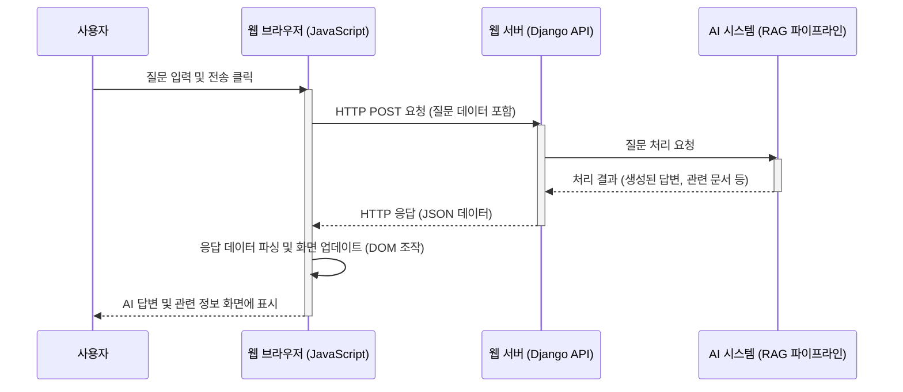

# Chapter 5: 사용자 인터페이스 (챗봇 및 정보 패널)

안녕하세요! `SKN10-4th-1Team` 프로젝트 튜토리얼의 다섯 번째 장에 오신 것을 환영합니다. 지난 [Chapter 4: 데이터 수집 및 전처리 스크립트](04_데이터_수집_및_전처리_스크립트_.md)에서는 우리 시스템의 지식 창고를 채우는 논문 데이터 준비 과정을 알아보았습니다. 이렇게 잘 준비된 방대한 지식을 사용자가 어떻게 쉽고 편리하게 활용할 수 있을까요?

이번 장에서는 바로 그 **사용자와 시스템 간의 소통 창구, "사용자 인터페이스 (UI)"**에 대해 자세히 알아볼 거예요. 사용자가 마치 똑똑한 AI 비서와 대화하듯 질문하고, 그 결과를 한눈에 파악할 수 있도록 도와주는 화면 구성, 즉 **챗봇**과 **정보 패널**이 어떻게 작동하는지 함께 살펴봅시다!

## 사용자 인터페이스, 왜 필요할까요? AI와의 똑똑한 대화 창구!

만약 여러분이 "최근 당뇨병 치료에 사용되는 새로운 약물 연구 동향은 어떤가요?"라는 질문을 AI에게 하고 싶다고 상상해 보세요. 단순히 질문만 던지는 것을 넘어, AI가 찾아준 답변을 명확히 이해하고, 관련 논문들의 핵심 내용, 저자, 그리고 그 논문들이 서로 어떻게 연결되어 있는지까지 한눈에 보고 싶을 거예요.

이러한 모든 과정을 가능하게 하는 것이 바로 **사용자 인터페이스(UI)**입니다. 우리 시스템의 UI는 다음과 같은 핵심적인 역할을 수행합니다:

1.  **손쉬운 질문**: 사용자가 복잡한 명령어 없이 자연스러운 문장으로 AI에게 질문을 던질 수 있는 창구를 제공합니다.
2.  **명확한 답변 제시**: AI가 생성한 답변을 사람이 이해하기 쉬운 형태로 보여줍니다. (예: 채팅 메시지, 표, 목록 등)
3.  **심층 정보 탐색**: 답변과 함께 제공되는 관련 논문 목록, 선택한 논문의 상세 정보(저자, 출판 연도, 키워드 등), 논문 간의 연결 관계 등을 시각적으로 제공하여 사용자의 연구 과정을 돕습니다.

쉽게 말해, 사용자 인터페이스는 우리 시스템의 "얼굴"이자, 사용자가 시스템의 강력한 기능을 최대한 활용할 수 있도록 돕는 "안내자" 역할을 하는 셈이죠!

## 메디리서치 AI의 얼굴: 사용자 인터페이스 구성 요소

우리 `SKN10-4th-1Team` 프로젝트의 사용자 인터페이스는 크게 두 가지 주요 부분으로 나뉩니다: **챗봇 창**과 **정보 패널**. 이 두 요소는 `templates/api/chatbot.html` 파일에 그 구조가 정의되어 있습니다.

### 1. 챗봇 창: AI와의 대화 채널 💬

챗봇 창은 사용자와 AI가 직접적으로 소통하는 공간입니다. 마치 우리가 친구와 스마트폰 메신저로 대화하는 것과 비슷해요.

*   **질문 입력창**: 사용자가 궁금한 점을 텍스트로 입력하는 곳입니다.
    ```html
    <!-- templates/api/chatbot.html 일부 -->
    <input type="text" id="userInput" placeholder="여기에 질문을 입력하세요...">
    <button id="sendButton"><i class="bi bi-send-fill"></i></button>
    ```
    위 HTML 코드는 사용자가 질문을 타이핑할 수 있는 입력 칸(`userInput`)과 질문을 전송하는 버튼(`sendButton`)을 만듭니다.

*   **대화 내용 표시 영역**: 사용자의 질문과 AI의 답변이 시간 순서대로 번갈아 나타나는 곳입니다.
    ```html
    <!-- templates/api/chatbot.html 일부 -->
    <div id="chatContainer" class="chat-container">
        <!-- 사용자와 AI의 메시지가 여기에 추가됩니다 -->
    </div>
    ```
    `chatContainer`라는 `div` 영역에 JavaScript를 통해 사용자와 AI의 메시지가 동적으로 추가됩니다. AI의 답변은 전문적인 내용을 담고 있을 수 있으므로, 가독성을 높이기 위해 마크다운(Markdown) 형식으로 표현되기도 합니다. 이때 `marked.js` 라이브러리가 마크다운 텍스트를 HTML로 변환해 주고, 코드 블록이 있다면 `highlight.js`가 예쁘게 강조해 줍니다.

### 2. 정보 패널: 연구 여정의 나침반 🧭

챗봇 창 오른쪽에 위치한 정보 패널은 AI의 답변을 뒷받침하는 구체적인 정보들을 보여주어 사용자의 연구를 더욱 깊이 있게 만듭니다. 마치 잘 정리된 연구 노트나 참고자료 모음집 같아요.

*   **검색된 논문 목록 (`#retrievedDocs`)**: AI가 답변을 생성하는 데 참고한 논문들의 목록이 표시됩니다. 각 논문은 제목, PMID(논문 고유번호), 그리고 검색 방식(벡터/그래프) 및 관련성 점수와 함께 간략하게 나타납니다.
    ```html
    <!-- templates/api/chatbot.html 정보 패널 일부 -->
    <div>
        <h3 class="sidebar-section-title"><i class="bi bi-search-heart"></i>검색 결과</h3>
        <div id="retrievedDocs" class="space-y-3">
            <!-- 검색된 논문 카드들이 여기에 표시됩니다. -->
        </div>
    </div>
    ```
    사용자는 이 목록에서 관심 있는 논문을 클릭하여 더 자세한 정보를 볼 수 있습니다.

*   **선택 논문 정보 (`#relatedInfo`)**: 사용자가 검색된 논문 목록에서 특정 논문을 선택하면, 그 논문의 상세 정보(저자, 키워드, 발행 연도, 저널 등)가 여기에 표시됩니다.
    ```html
    <!-- templates/api/chatbot.html 정보 패널 일부 -->
    <div>
        <h3 class="sidebar-section-title"><i class="bi bi-info-circle"></i>선택 논문 정보</h3>
        <div id="relatedInfo" class="space-y-2 text-sm">
            <!-- 선택된 논문의 저자, 키워드 등이 여기에 표시됩니다. -->
        </div>
    </div>
    ```

*   **논문 간 연결 (`#connections`)**: 선택된 논문과 다른 논문들이 어떤 관계(예: 공통 저자, 유사 키워드, 인용 관계 등)로 연결되어 있는지 시각적으로 보여줍니다. 이는 [Chapter 3: Neo4j 데이터 모델 및 연동](03_neo4j_데이터_모델_및_연동_.md)에서 배운 그래프 데이터베이스의 힘을 빌려 구현됩니다.
    ```html
    <!-- templates/api/chatbot.html 정보 패널 일부 -->
    <div>
        <h3 class="sidebar-section-title"><i class="bi bi-diagram-3"></i>논문 간 연결</h3>
        <div id="connections" class="space-y-2 text-sm">
            <!-- 선택된 논문과 연결된 다른 논문 정보가 여기에 표시됩니다. -->
        </div>
    </div>
    ```

이처럼 챗봇과 정보 패널은 서로 긴밀하게 연동되어 사용자에게 풍부하고 맥락적인 정보를 제공합니다.

## 사용자 인터페이스, 이렇게 사용해요! (사용자 여정)

자, 그럼 가상의 연구자 '이지혜' 씨가 되어 우리 시스템을 사용하는 과정을 따라가 볼까요?

1.  **질문 입력**: 지혜 씨는 챗봇 입력창에 "당뇨병과 비만의 연관성에 대한 최신 논문 알려줘"라고 입력하고 전송 버튼을 누릅니다.
2.  **AI 답변 확인**: 잠시 후, 챗봇 창에 AI의 답변이 나타납니다. "당뇨병과 비만은 밀접한 관련이 있으며, 다수의 연구에서 이를 뒷받침합니다. 주요 연구 결과는 다음과 같습니다..." 와 같이 요약된 설명과 함께 답변이 표시됩니다.
3.  **정보 패널 - 검색된 논문 확인**: 동시에 오른쪽 정보 패널의 '검색 결과' 섹션에는 AI가 참고한 관련 논문 목록이 나타납니다. 각 논문 옆에는 관련성 점수와 함께 어떤 검색 방식([하이브리드 RAG 파이프라인](02_하이브리드_rag_파이프라인_.md)에서 결정된 벡터/그래프/하이브리드)으로 찾아졌는지 아이콘으로 표시될 수 있습니다.
4.  **정보 패널 - 논문 상세 정보 보기**: 지혜 씨는 목록에서 가장 흥미로워 보이는 논문 제목을 클릭합니다. '선택 논문 정보' 섹션에 해당 논문의 저자 목록, 주요 키워드, 발행 연도 등의 상세 정보가 나타납니다.
5.  **정보 패널 - 논문 간 연결 관계 파악**: '논문 간 연결' 섹션에는 방금 선택한 논문과 관련된 다른 논문들이 어떤 공통점(예: "키워드 '인슐린 저항성' 공유", "저자 '김박사' 공저")으로 연결되어 있는지 표시됩니다.

이 과정을 통해 지혜 씨는 단순히 질문에 대한 답변을 얻는 것을 넘어, 관련된 다양한 정보들을 탐색하며 연구에 필요한 깊이 있는 통찰을 얻을 수 있습니다.

## 사용자 인터페이스 엿보기: 코드와 함께 (HTML & JavaScript)

사용자 인터페이스의 핵심 기능들은 `templates/api/chatbot.html` 파일에 담긴 HTML 구조와 JavaScript 코드를 통해 구현됩니다. 모든 코드를 다 보여드릴 순 없지만, 몇 가지 중요한 부분을 함께 살펴봅시다.

### 메시지 전송 로직 (JavaScript)

사용자가 입력창에 질문을 입력하고 '전송' 버튼을 누르면, `sendMessage` 함수가 호출됩니다.

```javascript
// templates/api/chatbot.html 의 <script> 태그 내부 (간략화)
function sendMessage() {
    const query = userInput.value.trim(); // 입력창의 텍스트 가져오기
    if (!query) return; // 내용이 없으면 아무것도 안 함

    appendMessage(query, 'user'); // 사용자의 메시지를 화면에 표시
    userInput.value = ''; // 입력창 비우기
    
    loadingIndicator.classList.remove('hidden'); // 로딩 표시 보이기

    // 서버에 질문을 보내고 답변을 받기 위한 요청 (fetch API 사용)
    fetch('/search/', { /* ... 요청 설정 ... */ })
        .then(response => response.json())
        .then(data => {
            handleApiResponse(data); // 서버 응답 처리 함수 호출
        })
        .catch(error => { /* ... 오류 처리 ... */ });
}
```
-   `userInput.value.trim()`: 사용자가 입력한 질문을 가져옵니다.
-   `appendMessage(query, 'user')`: 사용자의 질문을 채팅창에 표시하는 함수를 호출합니다.
-   `fetch('/search/', ...)`: `/search/` 라는 주소로 서버에 사용자의 질문(`query`)을 보내고 답변을 요청합니다. 이 과정은 다음 챕터 [API 요청 처리 및 응답](06_api_요청_처리_및_응답_.md)에서 자세히 다룹니다.
-   `handleApiResponse(data)`: 서버로부터 받은 응답 데이터(`data`)를 화면에 예쁘게 보여주는 함수를 호출합니다.

### 채팅 메시지 화면에 표시하기 (JavaScript)

`appendMessage` 함수는 사용자의 질문이나 AI의 답변을 받아 채팅창에 새로운 말풍선 형태로 추가합니다.

```javascript
// templates/api/chatbot.html 의 <script> 태그 내부 (간략화)
function appendMessage(text, sender) {
    const messageDiv = document.createElement('div'); // 새 div 요소 생성
    // ... (메시지 스타일에 맞게 CSS 클래스 추가) ...

    if (sender === 'user') {
        messageDiv.textContent = text; // 사용자 메시지는 텍스트 그대로
    } else { // AI 메시지는 Markdown을 HTML로 변환
        messageDiv.innerHTML = marked.parse(text); 
        // 코드 블록이 있다면 하이라이팅 적용
        messageDiv.querySelectorAll('pre code').forEach(block => {
           hljs.highlightElement(block);
        });
    }
    chatContainer.appendChild(messageDiv); // 채팅창에 메시지 추가
    chatContainer.scrollTop = chatContainer.scrollHeight; // 항상 최신 메시지 보이도록 스크롤
}
```
-   AI의 답변(`sender`가 'assistant'일 경우)은 `marked.parse(text)`를 통해 Markdown 형식의 텍스트가 HTML로 변환되어 풍부한 표현(제목, 목록, 코드 블록 등)이 가능해집니다.

### 정보 패널 업데이트 (JavaScript 예시 - 검색된 논문)

서버로부터 응답을 받으면 (`handleApiResponse` 함수 내에서), `updateRetrievedDocs` 같은 함수들이 호출되어 정보 패널의 내용을 업데이트합니다.

```javascript
// templates/api/chatbot.html 의 <script> 태그 내부 (간략화)
function updateRetrievedDocs(docs) {
    retrievedDocs.innerHTML = ''; // 기존 내용 비우기
    if (!docs || docs.length === 0) { /* ... 검색 결과 없음 표시 ... */ return; }

    docs.forEach(doc => { // 각 논문 정보를 반복 처리
        const docCard = document.createElement('div'); // 논문 카드 div 생성
        // ... (docCard에 CSS 클래스 및 스타일 적용) ...
        docCard.innerHTML = `
            <a href="https://pubmed.ncbi.nlm.nih.gov/${doc.pmid}/" target="_blank">${doc.title}</a>
            <p>PMID: ${doc.pmid}</p>
            <p>Score: ${doc.similarity.toFixed(2)}</p>
        `;
        // 사용자가 논문 카드를 클릭했을 때 상세 정보 로드하는 이벤트 연결
        docCard.addEventListener('click', () => fetchDocumentInfo(doc.pmid));
        retrievedDocs.appendChild(docCard); // 정보 패널에 논문 카드 추가
    });
    if (docs.length > 0) fetchDocumentInfo(docs[0].pmid); // 첫 번째 논문 정보 자동 로드
}
```
-   서버에서 받은 논문 목록(`docs`)을 바탕으로 각 논문에 대한 정보를 담은 카드(`docCard`)를 만들어 '검색 결과' 섹션 (`retrievedDocs`)에 추가합니다.
-   각 카드를 클릭하면 `fetchDocumentInfo(doc.pmid)` 함수가 호출되어 해당 논문의 상세 정보와 연결 관계를 서버에 요청하고, 그 결과를 받아 '#relatedInfo' 및 '#connections' 영역을 업데이트합니다.

## 사용자 인터페이스의 뒷모습: 내부 작동 원리

사용자가 화면에서 버튼을 누르고 글자를 입력할 때, 보이지 않는 곳에서는 어떤 일들이 벌어질까요?

### 간단한 상호작용 흐름도

사용자가 질문을 입력하고 답변을 받기까지의 과정을 간단한 순서도로 나타내면 다음과 같습니다.



1.  **사용자 입력**: 사용자가 웹 브라우저(우리의 `chatbot.html` 페이지)에서 질문을 입력하고 전송합니다.
2.  **JavaScript 요청**: 브라우저의 JavaScript(`sendMessage` 함수)가 이 입력을 받아, 웹 서버의 특정 API 주소(예: `/search/`)로 HTTP 요청을 보냅니다. 이 요청에는 사용자의 질문 내용이 담겨있습니다.
3.  **서버 처리**: 웹 서버(Django)는 이 요청을 받아 [API 요청 처리 및 응답](06_api_요청_처리_및_응답_.md) 로직을 통해 AI 시스템([하이브리드 RAG 파이프라인](02_하이브리드_rag_파이프라인_.md))에게 질문 처리를 위임합니다. AI 시스템은 [LLM 통합 (응답 생성 및 쿼리 이해)](01_llm_통합__응답_생성_및_쿼리_이해__.md)과 [Neo4j 데이터 모델 및 연동](03_neo4j_데이터_모델_및_연동_.md)을 활용하여 답변과 관련 정보를 생성합니다.
4.  **서버 응답**: AI 시스템으로부터 결과를 받은 웹 서버는 이 정보를 JSON 형태 등으로 가공하여 다시 브라우저에게 HTTP 응답으로 전달합니다.
5.  **화면 업데이트**: 브라우저의 JavaScript(`handleApiResponse` 및 관련 함수들)가 이 응답을 받아 내용을 분석하고, 챗봇 창과 정보 패널의 내용을 동적으로 변경(DOM 조작)하여 사용자에게 보여줍니다.

### 코드 속 인터페이스 마법: `chatbot.html`의 JavaScript 심층 탐구

`chatbot.html`에 포함된 JavaScript 코드는 이 모든 상호작용을 가능하게 하는 핵심입니다.

*   **이벤트 리스너 (Event Listeners)**:
    *   `sendButton.addEventListener('click', sendMessage);`: '전송' 버튼 클릭 시 `sendMessage` 함수 실행.
    *   `userInput.addEventListener('keydown', ...)`: 입력창에서 Enter 키 입력 시 `sendMessage` 함수 실행.
    *   정보 패널의 각 논문 카드(`docCard`)에 클릭 이벤트 리스너를 추가하여 `fetchDocumentInfo` 함수 실행.

*   **서버 통신 (`fetch` API)**:
    *   `fetch('/search/', { ... })`: 사용자의 질문을 서버의 `/search/` API로 전송하고 응답을 받습니다.
    *   `fetch('/search/document_info/?pmid=${pmid}', { ... })`: 특정 논문의 상세 정보 및 연결 관계를 서버의 `/search/document_info/` API로 요청합니다.
    *   비동기 방식(Promise 기반)으로 작동하여, 서버 응답을 기다리는 동안 브라우저가 멈추지 않고 다른 작업을 할 수 있게 합니다.

*   **DOM 조작 (화면 업데이트 함수들)**:
    *   `appendMessage(text, sender)`: 새 메시지를 챗봇 창에 추가.
    *   `updateRetrievedDocs(docs)`: 검색된 논문 목록을 정보 패널에 표시.
    *   `updateRelatedInfo(info)`: 선택된 논문의 상세 정보를 정보 패널에 표시.
    *   `updateConnections(conns)`: 선택된 논문의 연결 관계를 정보 패널에 표시.
    *   `loadingIndicator`: AI가 응답을 생성하는 동안 사용자에게 진행 중임을 알리는 로딩 애니메이션을 보여주거나 숨깁니다.
    *   `updateQueryTypeBadge(queryType)`: 현재 어떤 검색 모드(벡터, 그래프, 하이브리드)로 검색이 수행되었는지 사용자에게 알려줍니다.

이러한 JavaScript 코드들이 유기적으로 작동하며 사용자와 시스템 간의 부드러운 상호작용을 만들어냅니다.

## 정리하며

이번 장에서는 우리 `SKN10-4th-1Team` 시스템의 "얼굴"인 **사용자 인터페이스**에 대해 알아보았습니다. 사용자가 AI와 편리하게 대화할 수 있는 **챗봇 창**과, 연구에 필요한 깊이 있는 정보를 제공하는 **정보 패널**이 어떻게 구성되고 작동하는지 살펴보았습니다. HTML로 뼈대를 만들고 JavaScript로 생명을 불어넣어, 사용자가 시스템의 강력한 검색 및 분석 기능을 쉽고 직관적으로 활용할 수 있도록 돕는다는 것을 이해했습니다.

사용자 인터페이스가 아무리 훌륭해도, 그 뒤에서 실제로 요청을 받아 처리하고 응답을 돌려주는 똑똑한 "일꾼"이 없다면 무용지물이겠죠? 사용자가 질문을 입력했을 때, 웹 서버는 이 요청을 어떻게 받아들이고, AI 시스템에게 어떻게 전달하며, 그 결과를 다시 사용자 인터페이스로 어떻게 보내줄까요?

다음 장인 [Chapter 6: API 요청 처리 및 응답](06_api_요청_처리_및_응답_.md)에서는 바로 이 사용자 인터페이스와 시스템 내부 로직을 연결하는 다리 역할을 하는 API(Application Programming Interface)가 어떻게 요청을 처리하고 응답을 생성하는지 자세히 알아보겠습니다. 보이지 않는 곳에서 일어나는 데이터의 여정을 함께 따라가 봅시다!

---

Generated by [AI Codebase Knowledge Builder](https://github.com/The-Pocket/Tutorial-Codebase-Knowledge)