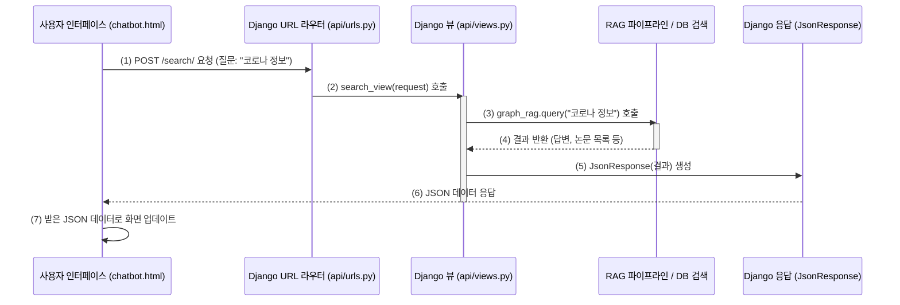

# Chapter 6: API 요청 처리 및 응답


안녕하세요! `SKN10-4th-1Team` 프로젝트 튜토리얼의 여섯 번째 장에 오신 것을 환영합니다. 지난 [5장: 사용자 인터페이스 (챗봇 및 정보 패널)](05_사용자_인터페이스__챗봇_및_정보_패널__.md)에서는 사용자가 우리 시스템과 직접 소통하는 창구인 챗봇 화면과 정보 패널에 대해 알아보았습니다. 사용자가 질문을 입력하고 버튼을 누르면, 그 요청은 과연 어떻게 시스템의 "두뇌"까지 전달되고, 처리된 결과는 또 어떻게 다시 화면으로 돌아오는 걸까요?

이번 장에서는 바로 이 **"API 요청 처리 및 응답"** 이라는 중요한 과정을 함께 파헤쳐 볼 거예요. 마치 식당의 웨이터처럼, 사용자의 주문(요청)을 주방(우리 시스템의 핵심 로직)에 전달하고, 완성된 요리(응답)를 다시 사용자에게 가져다주는 역할을 하는 API에 대해 알아봅시다!

## API는 왜 필요할까요? 시스템의 친절한 안내 데스크!

여러분은 [5장: 사용자 인터페이스 (챗봇 및 정보 패널)](05_사용자_인터페이스__챗봇_및_정보_패널__.md)에서 본 챗봇 창에 "코로나 바이러스 최신 치료법 알려줘" 라고 질문을 입력했다고 상상해 보세요. 이 질문은 어떻게 우리 시스템 내부의 [하이브리드 RAG 파이프라인](02_하이브리드_rag_파이프라인_.md)에 전달되어 답변을 얻어올 수 있을까요? 그리고 그 답변은 또 어떻게 다시 챗봇 창에 예쁘게 표시될 수 있을까요?

바로 이때 필요한 것이 **API (Application Programming Interface)** 입니다. API는 우리 웹 애플리케이션의 **"안내 데스크"** 또는 **"통역사"** 와 같아요. 사용자가 웹사이트에서 어떤 행동(예: 검색 버튼 클릭)을 하면, 그 신호를 받아서 내부의 담당자(우리 시스템의 특정 기능)에게 전달하고, 처리가 끝나면 그 결과를 사용자가 이해할 수 있는 형태로 다시 웹사이트로 보내주는 역할을 합니다.

API가 없다면, 아무리 멋진 사용자 인터페이스와 강력한 내부 기능을 만들어도 서로 "대화"할 방법이 없어서 아무것도 할 수 없을 거예요. API는 이 둘 사이를 연결하는 든든한 다리랍니다.

## API 요청과 응답의 핵심 요소들

API를 통해 정보를 주고받는 과정은 크게 "요청"과 "응답"으로 나눌 수 있습니다. 이 과정에 사용되는 몇 가지 중요한 개념들을 알아봅시다.

### 1. API (Application Programming Interface) 란?
앞서 말했듯이, 프로그램(애플리케이션)들이 서로 소통하기 위한 약속된 방법들의 모음입니다. 웹에서는 주로 사용자의 웹 브라우저(클라이언트)와 웹 서버가 데이터를 주고받기 위한 규칙들을 의미해요. 우리 프로젝트에서는 사용자의 챗봇 인터페이스가 웹 서버에게 "이 질문에 대한 답변을 줘!" 라고 말할 수 있게 해주는 창구 역할을 합니다.

### 2. 요청 (Request): "이것 좀 해주세요!"
사용자가 웹사이트에서 어떤 행동을 하면, 웹 브라우저는 서버에게 "요청"을 보냅니다.
*   **무엇을? (URL/엔드포인트)**: 요청을 보내는 특정 주소입니다. 예를 들어, 사용자가 검색 질문을 보내면 `/search/` 라는 주소로 요청이 갈 수 있습니다. 이 주소를 **엔드포인트(Endpoint)** 라고도 불러요.
*   **어떻게? (HTTP 메소드)**: 요청의 종류를 나타냅니다.
    *   `GET`: "정보 좀 보여줘!" (예: 특정 논문 상세 정보 보기)
    *   `POST`: "새로운 정보 전달할게, 처리해줘!" (예: 새로운 검색 질문 보내기)
*   **무슨 내용을? (본문/파라미터)**: 요청과 함께 전달되는 데이터입니다. POST 요청의 경우 "본문(body)"에, GET 요청의 경우 URL의 "?키=값" 형태로 "파라미터(parameter)"에 담겨 전달될 수 있습니다. (예: 검색어 "코로나 치료법")

### 3. 응답 (Response): "요청하신 결과입니다!"
서버는 받은 요청을 처리하고, 그 결과를 다시 웹 브라우저에게 "응답"으로 돌려줍니다.
*   **처리 결과 (상태 코드)**: 요청이 성공했는지, 실패했는지 등을 숫자로 알려줍니다. (예: `200 OK` - 성공, `404 Not Found` - 요청한 페이지 없음, `500 Internal Server Error` - 서버 내부 오류)
*   **전달할 내용 (본문)**: 실제 전달되는 데이터입니다. 우리 시스템에서는 주로 **JSON (JavaScript Object Notation)** 형식을 사용해요. JSON은 사람이 읽고 쓰기 쉬우면서, 기계도 이해하기 쉬운 텍스트 기반의 데이터 형식입니다. 마치 `{"이름": "홍길동", "나이": 30}` 처럼 키와 값으로 이루어져 있죠.

### 4. URL 패턴 (URLConf): "이 주소는 누가 담당하나요?"
서버는 수많은 종류의 요청을 받을 수 있습니다. 어떤 URL로 요청이 들어왔을 때, 어떤 기능을 실행시켜야 할지 미리 약속해두어야겠죠? Django 프레임워크에서는 `urls.py` 파일에 이러한 **URL 패턴(경로)**과 이를 처리할 **뷰 함수**를 연결해 줍니다.

예를 들어, `api/urls.py` 파일에 다음과 같은 내용이 있다면:
```python
# api/urls.py 일부
from django.urls import path
from . import views # 같은 폴더의 views.py 파일을 가져옴

urlpatterns = [
    path('search/', views.search_view, name='search_path'),
    # ... 다른 URL 패턴들 ...
]
```
이는 "만약 웹 브라우저가 우리 서버의 `/search/` 라는 주소로 요청을 보내면, `views.py` 파일 안에 있는 `search_view` 라는 함수가 그 요청을 처리하도록 해!" 라는 약속입니다.

### 5. 뷰 함수 (View Function): "제가 바로 담당자입니다!"
뷰 함수는 `urls.py`에 의해 지정된 특정 URL 요청을 실제로 받아서 처리하는 파이썬 함수입니다. `api/views.py` 파일에 이런 함수들이 모여있어요.

예를 들어, `views.search_view` 함수는 다음과 같이 생겼을 수 있습니다:
```python
# api/views.py 일부
from django.http import JsonResponse
# from rag_pipeline.graph_flow import HybridGraphFlow
# graph_rag = HybridGraphFlow() # RAG 파이프라인 인스턴스 (실제로는 앱 시작 시 초기화)

def search_view(request): # request 객체에는 사용자의 요청 정보가 담겨있어요!
    if request.method == 'POST':
        # 사용자가 보낸 질문 데이터 처리 (예: query = request.POST.get('query'))
        # ... RAG 파이프라인 호출하여 결과 받기 ...
        # result = graph_rag.query(query) 
        # 결과를 JSON 형태로 만들어서 응답
        # return JsonResponse({'answer': result['answer'], ...}) 
        return JsonResponse({'answer': '요청 처리 결과입니다!'}) # 간단 예시
    # ... 다른 HTTP 메소드 처리 또는 기본 페이지 보여주기 ...
    return JsonResponse({'error': '잘못된 요청입니다.'}) # 간단 예시
```
뷰 함수는 사용자의 요청(`request`)을 분석하고, 필요한 작업(예: [하이브리드 RAG 파이프라인](02_하이브리드_rag_파이프라인_.md) 호출)을 수행한 뒤, 그 결과를 `JsonResponse` 등을 이용해 응답으로 돌려줍니다.

## API 사용해보기: 질문부터 답변까지의 여정

자, 그럼 사용자가 챗봇에 질문을 입력했을 때부터 답변을 받기까지, API가 어떻게 활용되는지 구체적인 예를 통해 살펴봅시다.

### 1. 사용자 질문 전송 (클라이언트 측: JavaScript)

[5장: 사용자 인터페이스 (챗봇 및 정보 패널)](05_사용자_인터페이스__챗봇_및_정보_패널__.md)에서 본 것처럼, 사용자가 챗봇 입력창에 질문을 쓰고 '전송' 버튼을 누르면, 브라우저의 JavaScript 코드가 서버로 요청을 보냅니다.

```javascript
// templates/api/chatbot.html 의 <script> 태그 내부 (간략화)
async function sendMessage(query) { // query는 사용자가 입력한 질문
    const response = await fetch('/search/', { // (1) '/search/' API로 요청!
        method: 'POST',                      // (2) POST 방식으로!
        headers: {
            'Content-Type': 'application/json',
            'X-CSRFToken': getCookie('csrftoken') // Django CSRF 토큰
        },
        body: JSON.stringify({ query: query, chat_history: [] }) // (3) 질문 내용 전송!
    });
    const data = await response.json(); // (4) 서버 응답을 JSON으로 받기
    // data.answer 등을 사용해 화면에 답변 표시
    console.log(data.answer); 
}
```
1.  **`/search/` API로 요청**: `fetch` 함수를 사용해 우리 서버의 `/search/` 라는 주소(엔드포인트)로 요청을 보냅니다.
2.  **POST 방식**: 새로운 질문을 서버에 전달하여 처리를 요청하므로 `POST` 방식을 사용합니다.
3.  **질문 내용 전송**: `body` 부분에 사용자의 질문(`query`)과 이전 대화 내용(`chat_history`)을 JSON 문자열 형태로 담아 보냅니다.
4.  **서버 응답 받기**: 서버가 요청을 처리하고 보내준 응답을 JSON 형태로 받아서 `data` 변수에 저장합니다. 이 `data` 안에 AI가 생성한 답변이 들어있겠죠!

### 2. URL 연결 확인 (서버 측: `api/urls.py`)

서버는 `/search/` 라는 주소로 요청이 들어오면, `api/urls.py` 파일에 정의된 약속에 따라 어떤 뷰 함수를 실행할지 결정합니다.

```python
# api/urls.py (주요 부분)
from django.urls import path
from . import views # 현재 폴더(api)의 views.py 파일을 가져옵니다.

urlpatterns = [
    # 다른 URL 패턴들...
    # '/search/' 주소로 요청이 오면 views.py 파일의 search_view 함수를 실행!
    path('search/', views.search_view, name='search_path'), 
    # '/search/document_info/' 주소로 요청이 오면 document_info_view 함수 실행!
    path('search/document_info/', views.document_info_view, name='search_document_info'),
]
```
위 코드에서 `path('search/', views.search_view, ...)` 부분이 바로 이 약속입니다. 사용자가 `/search/`로 요청을 보내면, `api/views.py` 파일 안에 있는 `search_view` 함수가 호출됩니다.

### 3. 요청 처리 및 RAG 파이프라인 호출 (서버 측: `api/views.py`)

이제 `search_view` 함수가 실제로 사용자의 질문을 받고 처리하는 과정을 살펴봅시다.

```python
# api/views.py 의 search_view 함수 (주요 부분 간략화)
from django.http import JsonResponse
import json
from rag_pipeline.graph_flow import HybridGraphFlow # RAG 파이프라인

# graph_rag 인스턴스는 앱 시작 시 한 번만 생성되어 재사용됩니다.
graph_rag = HybridGraphFlow() 

def search_view(request):
    if request.method == 'POST': # (1) POST 요청인지 확인
        try:
            data = json.loads(request.body) # (2) 요청 본문에서 JSON 데이터 읽기
            query = data.get('query', '')      # (3) 사용자의 질문(query) 추출
            chat_history = data.get('chat_history', []) # 이전 대화 내용 추출

            if query:
                # (4) RAG 파이프라인 호출!
                result = graph_rag.query(query, chat_history) 
                
                # (5) 파이프라인 결과를 JSON 응답으로 구성
                response_data = {
                    'answer': result['answer'], # AI 답변
                    'retrieved_docs': result['retrieved_docs'], # 검색된 논문
                    # ... 기타 필요한 정보들 ...
                }
                return JsonResponse(response_data) # (6) JSON 형태로 응답 전송!
            # ... (오류 처리 등) ...
        except Exception as e:
            return JsonResponse({'error': f'오류 발생: {str(e)}'}, status=500)
    # ... (GET 요청 등 다른 경우 처리) ...
    return render(request, 'api/chatbot.html', {}) # GET 요청 시 챗봇 페이지 보여주기
```
1.  **POST 요청 확인**: `request.method == 'POST'`를 통해 POST 요청일 때만 이 로직을 실행합니다.
2.  **JSON 데이터 읽기**: `json.loads(request.body)`를 사용해 JavaScript가 보낸 JSON 문자열을 파이썬 딕셔너리 형태로 변환합니다.
3.  **질문 추출**: `data.get('query', '')`로 사용자의 질문을 꺼냅니다.
4.  **RAG 파이프라인 호출**: 드디어! `graph_rag.query(query, chat_history)`를 호출하여 [하이브리드 RAG 파이프라인](02_하이브리드_rag_파이프라인_.md)에게 실제 질문 처리를 맡깁니다.
5.  **응답 데이터 구성**: RAG 파이프라인이 반환한 결과(`result`)에서 필요한 정보(답변, 관련 논문 등)를 뽑아 `response_data` 딕셔너리에 담습니다.
6.  **JSON 응답 전송**: `JsonResponse(response_data)`를 사용해 이 딕셔너리를 JSON 형태로 변환하여 다시 웹 브라우저(JavaScript)에게 보냅니다.

### 4. 논문 상세 정보 요청 및 응답

사용자가 챗봇 화면에서 특정 논문을 클릭하면, 그 논문의 상세 정보를 가져오기 위해 또 다른 API 요청이 발생합니다.

*   **클라이언트 (JavaScript)**: 사용자가 PMID가 "12345"인 논문을 클릭하면, JavaScript는 다음과 같이 `/search/document_info/` API로 GET 요청을 보낼 수 있습니다.
    ```javascript
    // templates/api/chatbot.html 의 <script> 태그 내부 (간략화)
    async function fetchDocumentInfo(pmid) { // pmid는 선택된 논문의 ID
        const response = await fetch(`/search/document_info/?pmid=${pmid}`); // GET 요청
        const data = await response.json();
        // data.related_info, data.connections 등을 사용해 정보 패널 업데이트
        updateRelatedInfoPanel(data.related_info); 
        updateConnectionsPanel(data.connections);
    }
    ```
    이번에는 URL에 `?pmid=${pmid}` 와 같이 파라미터를 붙여서 어떤 논문의 정보를 원하는지 서버에 알립니다.

*   **서버 (api/urls.py)**: `/search/document_info/` 경로는 `views.document_info_view` 함수와 연결됩니다.

*   **서버 (api/views.py)**: `document_info_view` 함수는 이 요청을 처리합니다.
    ```python
    # api/views.py 의 document_info_view 함수 (주요 부분 간략화)
    from rag_pipeline.vector_store import Neo4jVectorSearch
    vector_search = Neo4jVectorSearch() # Neo4j 검색 도구

    def document_info_view(request):
        if request.method == 'GET': # (1) GET 요청인지 확인
            pmid = request.GET.get('pmid') # (2) URL 파라미터에서 pmid 추출
            if not pmid:
                return JsonResponse({'error': 'PMID가 필요합니다.'}, status=400)
            
            try:
                # (3) Neo4j에서 관련 노드 및 연결 정보 가져오기
                related_info = vector_search.get_related_nodes(pmid)
                connections = vector_search.find_article_connections(pmid)
                
                return JsonResponse({ # (4) JSON 응답 전송
                    'related_info': related_info,
                    'connections': connections
                })
            except Exception as e:
                # ... (오류 처리) ...
        return JsonResponse({'error': '잘못된 요청 방식입니다.'}, status=405)
    ```
    1.  **GET 요청 확인**: `request.method == 'GET'`
    2.  **PMID 추출**: `request.GET.get('pmid')`로 URL에서 `pmid` 값을 가져옵니다.
    3.  **정보 검색**: `vector_search` 객체 ( [Neo4j 데이터 모델 및 연동](03_neo4j_데이터_모델_및_연동_.md)에서 배운 기능을 사용)를 이용해 해당 PMID를 가진 논문의 상세 정보와 다른 논문과의 연결 관계를 [Neo4j 데이터 모델 및 연동](03_neo4j_데이터_모델_및_연동_.md)에서 조회합니다.
    4.  **JSON 응답**: 조회된 정보를 JSON 형태로 응답합니다.

이렇게 API를 통해 클라이언트(웹 브라우저)와 서버(Django 애플리케이션)는 필요한 정보를 주고받으며 상호작용합니다.

## API 요청 처리 흐름 한눈에 보기

사용자가 질문을 하고 답변을 받는 전체 과정을 간단한 순서도로 표현하면 다음과 같습니다.



1.  **요청 시작**: 사용자가 인터페이스에서 질문을 보내면, JavaScript가 `/search/` 엔드포인트로 POST 요청을 보냅니다.
2.  **URL 라우팅**: Django의 URL 라우터(`api/urls.py`)가 이 요청을 받아 `search_view` 함수에게 전달합니다.
3.  **핵심 로직 처리**: `search_view` 함수는 요청에서 질문을 추출하여 `HybridGraphFlow`의 `query` 메소드를 호출합니다. 여기서 [LLM 통합 (응답 생성 및 쿼리 이해)](01_llm_통합__응답_생성_및_쿼리_이해__.md) 및 [Neo4j 데이터 모델 및 연동](03_neo4j_데이터_모델_및_연동_.md)을 활용한 복잡한 처리가 이루어집니다.
4.  **결과 반환**: 핵심 로직은 처리 결과를 뷰 함수에게 돌려줍니다.
5.  **응답 생성**: 뷰 함수는 이 결과를 `JsonResponse`를 사용해 JSON 형태로 만듭니다.
6.  **응답 전송**: 생성된 JSON 응답이 다시 사용자 인터페이스(JavaScript)로 전달됩니다.
7.  **화면 업데이트**: JavaScript는 받은 JSON 데이터를 해석하여 챗봇 창과 정보 패널의 내용을 업데이트합니다.

## 코드 더 자세히 들여다보기

우리 프로젝트에서 API 요청 처리의 중심에는 `api/urls.py`와 `api/views.py` 파일이 있습니다.

### `api/urls.py`: 요청의 길잡이

이 파일은 어떤 URL 주소로 요청이 들어왔을 때, 어떤 파이썬 함수(뷰)가 그 요청을 처리해야 하는지를 정의하는 "지도"와 같습니다.

```python
# api/urls.py
from django.urls import path # URL 패턴을 정의하기 위한 도구
from . import views         # 같은 폴더(api)에 있는 views.py 파일을 가져옴

app_name = 'api' # 이 URL들의 그룹 이름 (선택 사항이지만, 나중에 편리)

urlpatterns = [
    # 웹사이트의 기본 주소('/')로 접속하면 views.home 함수 실행
    path('', views.home, name="homepage"), 
    
    # '/search/' 주소로 접속하면 views.search_view 함수 실행
    # name='search_path'는 이 URL 패턴에 붙이는 별명
    path('search/', views.search_view, name='search_path'), 
    
    # '/search/document_info/' 주소로 접속하면 views.document_info_view 함수 실행
    path('search/document_info/', views.document_info_view, name='search_document_info'),
    
    # (참고) 사용자 인증 관련 URL들은 'user/' 아래에 별도로 관리될 수 있음
    # path('login/', views.login, name="login"), 
]
```
-   `path(route, view, name)`: 이 함수가 핵심입니다.
    -   `route`: URL 경로 문자열 (예: `'search/'`)
    -   `view`: 이 경로로 요청이 왔을 때 실행될 뷰 함수 (예: `views.search_view`)
    -   `name`: 이 URL 패턴에 붙이는 이름. 코드 다른 곳에서 이 이름을 사용해 URL을 쉽게 참조할 수 있습니다.

### `api/views.py`: 실제 일꾼들

이 파일에는 `urls.py`에 의해 호출되는 실제 함수들이 들어있습니다. 각 함수는 특정 요청을 받아 처리하고 응답을 생성하는 로직을 담고 있습니다.

**`search_view` 함수 다시 보기 (주요 흐름)**

```python
# api/views.py 의 search_view 함수 일부
# ... (import 문들) ...
# graph_rag = HybridGraphFlow() # 앱 초기화 시 생성

# @login_required(login_url='/user/login/') # 이 표시는 로그인이 필요한 API임을 의미 (다음 장 내용)
def search_view(request: HttpRequest) -> HttpResponse:
    if request.method == 'POST': # POST 방식으로 요청이 왔을 때
        data = json.loads(request.body) # 요청 내용을 JSON으로 해석
        query = data.get('query', '') # 'query' 키의 값을 가져옴 (없으면 빈 문자열)
        # ... (chat_history 등 다른 데이터도 가져옴) ...

        if query: # 질문이 있다면
            # RAG 파이프라인에 질문 전달하여 결과 받기
            result = graph_rag.query(query, chat_history) 
            
            # 추가로, 첫 번째 검색된 문서의 연결 관계를 가져오는 로직 (예시)
            connections = []
            if result['retrieved_docs']:
                first_doc_pmid = result['retrieved_docs'][0].get('pmid')
                if first_doc_pmid:
                    # connections = vector_search.find_article_connections(first_doc_pmid)
                    pass # 실제 호출 부분은 필요에 따라 추가

            response_data = { # 응답할 데이터 꾸리기
                'answer': result['answer'],
                'retrieved_docs': result['retrieved_docs'],
                'connections': connections, # 예시로 추가한 연결 정보
                # ... (result 딕셔너리의 다른 유용한 정보들) ...
            }
            return JsonResponse(response_data) # JSON으로 응답!
        # ... (질문이 없을 때의 오류 처리) ...
    
    # GET 방식으로 '/search/'에 접속하면 챗봇 화면을 보여줌
    return render(request, 'api/chatbot.html', {}) 
```
-   `request`: Django가 전달해주는 객체로, 사용자의 요청에 대한 모든 정보(메소드, 헤더, 본문 등)를 담고 있습니다.
-   `request.method`: 요청이 `GET`인지 `POST`인지 등을 확인합니다.
-   `request.body`: 요청의 본문 내용 (주로 `POST` 요청 시 사용).
-   `render(request, template_name, context)`: HTML 템플릿을 이용해 웹 페이지를 만들어서 응답할 때 사용합니다. (GET 요청으로 `/search/`에 처음 접속했을 때 `chatbot.html`을 보여주는 경우)
-   `JsonResponse(data_dict)`: 파이썬 딕셔너리를 JSON 형식으로 변환하여 응답합니다. API를 만들 때 가장 많이 사용됩니다.

이처럼 `urls.py`와 `views.py`는 Django에서 웹 요청을 처리하고 응답하는 핵심적인 역할을 담당하며, 우리 시스템에서는 사용자의 질문을 받아 RAG 파이프라인으로 전달하고 그 결과를 다시 사용자에게 돌려주는 "안내 데스크"의 역할을 훌륭히 수행하고 있습니다.

## 정리하며

이번 장에서는 웹 애플리케이션의 안내 데스크와 같은 **API의 요청 처리 및 응답 과정**에 대해 자세히 알아보았습니다. 사용자가 챗봇 인터페이스에서 질문을 보내면, 이 요청이 어떻게 특정 URL(엔드포인트)로 전달되고, Django의 `urls.py`와 `views.py`를 통해 어떤 과정을 거쳐 처리되는지, 그리고 그 결과가 어떻게 다시 사용자에게 JSON 형태로 전달되는지 살펴보았습니다.

특히 `views.py` 안의 뷰 함수들이 [하이브리드 RAG 파이프라인](02_하이브리드_rag_파이프라인_.md)이나 [Neo4j 데이터 모델 및 연동](03_neo4j_데이터_모델_및_연동_.md)과 상호작용하여 실제적인 "일"을 하고, 그 결과를 API 응답으로 만들어내는 과정을 이해했습니다. 이를 통해 사용자 인터페이스와 시스템의 핵심 기능이 매끄럽게 연결될 수 있다는 것을 알게 되었습니다.

지금까지 우리는 시스템의 핵심 기능들과 사용자와의 소통 창구까지 모두 살펴보았습니다. 하지만 실제 웹 서비스를 운영하려면 사용자를 식별하고 관리하는 기능도 매우 중요합니다. 예를 들어, 사용자별로 검색 기록을 저장하거나, 특정 사용자에게만 접근 권한을 주고 싶을 수도 있겠죠?

다음 장인 [7장: 사용자 인증 및 관리](07_사용자_인증_및_관리_.md)에서는 바로 이러한 사용자 로그인, 회원가입 등의 인증 기능과 사용자 정보를 관리하는 방법에 대해 알아보겠습니다. 우리 시스템을 더욱 안전하고 개인화된 서비스로 만드는 여정을 함께 떠나봅시다!

---

Generated by [AI Codebase Knowledge Builder](https://github.com/The-Pocket/Tutorial-Codebase-Knowledge)