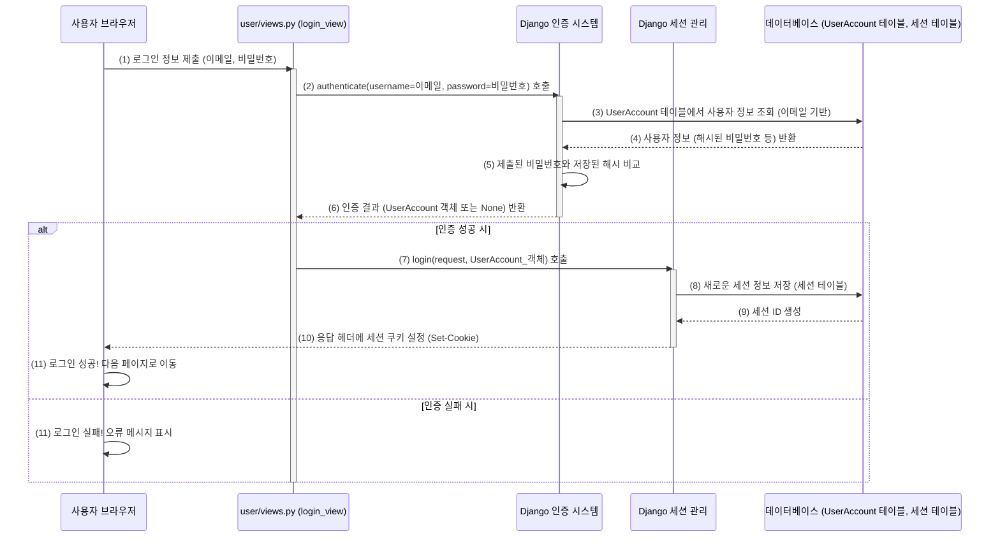

# Chapter 7: 사용자 인증 및 관리

안녕하세요! `SKN10-4th-1Team` 프로젝트 튜토리얼의 일곱 번째 장에 오신 것을 환영합니다. 지난 [Chapter 6: API 요청 처리 및 응답](06_api_요청_처리_및_응답_.md)에서는 사용자의 요청이 우리 시스템의 API를 통해 어떻게 처리되고 응답을 받는지 알아보았습니다. 사용자가 챗봇에서 질문을 보내면, 이 요청이 서버로 전달되고, Django의 뷰 함수들이 RAG 파이프라인과 상호작용하여 결과를 JSON 형태로 되돌려주는 과정을 이해했죠.

이번 장에서는 웹 서비스의 필수 기능 중 하나인 **사용자 인증 및 관리**에 대해 자세히 알아볼 거예요. 마치 우리 시스템의 "출입 관리 시스템"과 같아서, 누가 우리 서비스를 이용할 수 있는지, 그리고 각 사용자가 어떤 권한을 가지는지 등을 관리하는 중요한 부분입니다. 예를 들어, 사용자별로 검색 기록을 저장하거나, 특정 기능은 회원가입하고 로그인한 사용자만 이용할 수 있도록 제한하고 싶을 때 바로 이 기능이 필요하답니다!

## 사용자 인증 및 관리, 왜 필요할까요? 우리 시스템의 문지기!

여러분이 운영하는 멋진 의학 논문 검색 시스템이 있다고 상상해 보세요. 모든 사람이 모든 기능을 똑같이 사용하게 할 수도 있지만, 다음과 같은 상황을 고려해 볼 수 있습니다:
*   **개인화된 경험**: "김 연구원"님이 이전에 검색했던 내용이나 관심 있게 본 논문들을 기억했다가 다음에 접속했을 때 맞춤 정보를 제공하고 싶다면?
*   **고급 기능 제한**: "논문 네트워크 심층 분석"과 같은 고급 기능은 정식으로 가입한 연구자 회원에게만 제공하고 싶다면?
*   **데이터 보안**: 사용자의 민감한 정보(예: 개인 설정, 저장된 검색어)는 오직 본인만 볼 수 있도록 보호해야 한다면?

이런 모든 요구사항을 해결하기 위해 **사용자 인증(Authentication) 및 관리(Management)** 기능이 필요합니다.

*   **인증 (Authentication)**: "당신은 누구신가요?"를 확인하는 과정입니다. 가장 일반적인 예는 **로그인**이죠. 사용자가 아이디와 비밀번호를 입력하면, 시스템은 이 정보가 등록된 사용자의 정보와 일치하는지 확인합니다. 마치 건물에 들어갈 때 신분증을 보여주는 것과 같아요.
*   **인가 (Authorization)**: "당신은 무엇을 할 수 있나요?"를 결정하는 과정입니다. 인증을 통해 사용자가 누구인지 확인되면, 그 사용자가 시스템의 특정 기능이나 데이터에 접근할 수 있는 **권한**이 있는지 확인합니다. 신분증을 보여주고 건물에 들어왔더라도, 특정 사무실에 들어가려면 그에 맞는 출입 카드가 필요한 것과 비슷합니다.
*   **회원가입 (Registration)**: 새로운 사용자에게 "출입증"을 발급하는 과정입니다. 사용자가 자신의 정보를 시스템에 등록하고 계정을 만드는 것이죠.
*   **세션/토큰 (Session/Token)**: 사용자가 로그인에 성공하면, 시스템은 "당신은 인증된 사용자입니다"라는 증표를 발급합니다. 이 증표가 바로 세션 또는 토큰이며, 사용자는 이후 요청마다 이 증표를 제시하여 자신이 로그인 상태임을 알립니다. 마치 출입증을 목에 걸고 다니는 것과 같아요. Django는 기본적으로 세션 기반 인증을 강력하게 지원합니다.
*   **`UserAccount` 모델**: 사용자의 아이디, (암호화된) 비밀번호, 이메일 주소, 이름 등 개인 정보를 데이터베이스에 저장하는 "설계도"입니다. Django에서는 이 모델을 기반으로 실제 사용자 데이터를 관리합니다.
*   **`@login_required` 데코레이터**: 특정 웹 페이지나 기능에 대한 "출입 검사원" 역할을 합니다. 이 데코레이터가 붙어있는 기능에 접근하려고 할 때, 사용자가 로그인되어 있지 않으면 로그인 페이지로 보내버립니다.

우리 프로젝트에서는 Django의 강력한 내장 인증 시스템을 활용하여 이러한 기능들을 구현합니다. `user` 앱(`user/views.py`, `user/models.py`)이 주로 이 역할을 담당하고, `api/views.py`의 특정 기능에도 `@login_required`를 사용하여 접근을 제어합니다.

## 우리 시스템의 출입 관리 살펴보기

사용자가 우리 시스템을 이용하며 겪게 될 회원가입, 로그인, 로그아웃 과정을 통해 사용자 인증 및 관리가 어떻게 작동하는지 알아봅시다.

### 1. 새로운 사용자 등록: 회원가입 (`signup`)

처음 우리 시스템을 이용하려는 사용자는 먼저 회원가입을 해야 합니다.

**사용자 화면 (HTML - `user/회원가입.html` 일부)**:
사용자는 이름, 이메일 주소, 비밀번호 등을 입력하는 폼을 보게 됩니다.

```html
<!-- user/회원가입.html 템플릿의 폼 예시 (간략화) -->
<form method="POST" action="">
     <!-- 보안을 위한 Django 태그 -->
    <input type="text" name="fullName" placeholder="이름" required>
    <input type="email" name="email" placeholder="이메일 (ID로 사용)" required>
    <input type="password" name="password" placeholder="비밀번호" required>
    <input type="password" name="confirmPassword" placeholder="비밀번호 확인" required>
    <button type="submit">회원가입</button>
</form>
```
*   `action=""`: 폼 데이터가 `user` 앱의 `signup`이라는 이름으로 등록된 URL로 전송됨을 의미합니다.
*   ``: Django가 제공하는 보안 기능으로, 악의적인 요청을 방지합니다.

**서버 처리 (`user/views.py`의 `signup_view` 함수)**:
사용자가 폼을 제출하면, `user/views.py`의 `signup_view` 함수가 이 요청을 처리합니다.

```python
# user/views.py 의 signup_view 함수 (주요 로직 간략화)
from django.shortcuts import render, redirect
from django.contrib import messages
from user.models import UserAccount # 사용자 계정 모델

def signup_view(request):
    if request.method == 'POST':
        # 폼에서 입력된 정보 가져오기
        full_name = request.POST.get('fullName')
        email = request.POST.get('email') # 이메일을 username으로 사용
        password = request.POST.get('password')
        # ... (비밀번호 확인, 이메일 중복 검사 등) ...

        # UserAccount 모델을 사용해 새 사용자 생성 및 저장
        UserAccount.objects.create_user(
            username=email, # Django User 모델은 username 필드를 기본으로 사용
            email=email,
            password=password,
            first_name=full_name
        )
        messages.success(request, '회원가입이 완료되었습니다. 로그인해주세요.')
        return redirect('user:login') # 로그인 페이지로 이동
    return render(request, 'user/회원가입.html')
```
*   사용자가 제출한 정보를 바탕으로 `UserAccount.objects.create_user()`를 호출하여 데이터베이스에 새로운 사용자 정보를 저장합니다. 이때 비밀번호는 자동으로 안전하게 암호화되어 저장됩니다.
*   성공하면 로그인 페이지로 안내합니다.

### 2. 시스템 접근 권한 얻기: 로그인 (`login`)

회원가입을 마친 사용자는 이제 로그인을 통해 시스템에 접근할 수 있습니다.

**사용자 화면 (HTML - `user/로그인.html` 일부)**:
사용자는 이메일(ID)과 비밀번호를 입력하는 폼을 봅니다.

```html
<!-- user/로그인.html 템플릿의 폼 예시 (간략화) -->
<form method="POST" action="">
    
    <input type.email" name="email" placeholder="이메일 (ID)" required>
    <input type="password" name="password" placeholder="비밀번호" required>
    <button type="submit">로그인</button>
</form>
```

**서버 처리 (`user/views.py`의 `login_view` 함수)**:
`login_view` 함수가 로그인 요청을 처리합니다.

```python
# user/views.py 의 login_view 함수 (주요 로직 간략화)
from django.contrib.auth import authenticate, login # Django 인증 도구

def login_view(request):
    if request.method == 'POST':
        email = request.POST.get('email')
        password = request.POST.get('password')

        # Django의 authenticate 함수로 사용자 인증 시도
        # username 필드에 이메일 값을 전달
        user = authenticate(request, username=email, password=password) 
        
        if user is not None: # 인증 성공 시
            login(request, user) # Django의 login 함수로 세션 생성 (로그인 상태 유지)
            messages.success(request, f'{user.first_name}님, 환영합니다!')
            return redirect('api:homepage') # 홈페이지로 이동
        else: # 인증 실패 시
            messages.error(request, '이메일 또는 비밀번호가 잘못되었습니다.')
            return redirect('user:login')
    return render(request, 'user/로그인.html')
```
*   `authenticate(request, username=email, password=password)`: Django의 핵심 인증 함수입니다. 제공된 이메일(username으로 사용)과 비밀번호가 데이터베이스에 저장된 정보와 일치하는지 확인합니다. 일치하면 해당 `UserAccount` 객체를, 아니면 `None`을 반환합니다.
*   `login(request, user)`: 인증에 성공하면, 이 함수가 호출되어 사용자를 위한 세션(session)을 생성하고, 사용자의 브라우저에 세션 ID가 담긴 쿠키를 설정합니다. 이 쿠키 덕분에 사용자는 다음 요청부터 로그인 상태를 유지할 수 있습니다.

### 3. 시스템 이용 종료: 로그아웃 (`logout`)

시스템 사용을 마친 사용자는 로그아웃할 수 있습니다.

**서버 처리 (`user/views.py`의 `logout_view` 함수)**:
별도의 HTML 폼 없이, 특정 URL (예: `/user/logout/`)로 GET 요청을 보내면 로그아웃 처리됩니다.

```python
# user/views.py 의 logout_view 함수
from django.contrib.auth import logout

def logout_view(request):
    if request.method == 'GET': # 보통 로그아웃은 GET 요청으로 처리
        logout(request) # Django의 logout 함수로 세션 무효화
        messages.info(request, '로그아웃되었습니다.')
    return redirect('api:homepage') # 홈페이지로 이동
```
*   `logout(request)`: 현재 사용자의 세션 정보를 서버와 브라우저 양쪽에서 제거하여 로그인 상태를 해제합니다.

### 4. 특정 기능 접근 제한: `@login_required` 데코레이터

우리 시스템의 핵심 기능인 논문 검색(`search_view`)은 로그인한 사용자만 이용할 수 있도록 설정할 수 있습니다. 이때 `@login_required` 데코레이터가 사용됩니다.

**코드 예시 (`api/views.py`의 `search_view` 함수)**:

```python
# api/views.py 의 search_view 함수 상단
from django.contrib.auth.decorators import login_required

# @login_required 데코레이터는 이 함수가 호출되기 전에 사용자가 로그인했는지 확인합니다.
# login_url='/user/login/' : 만약 로그인되어 있지 않다면, /user/login/ 페이지로 이동시킵니다.
@login_required(login_url='/user/login/') 
def search_view(request: HttpRequest) -> HttpResponse:
    # ... (기존 검색 로직) ...
    # 이 부분은 로그인한 사용자만 실행할 수 있습니다.
    if request.method == 'POST':
        # ... (질문 처리 및 RAG 파이프라인 호출) ...
        return JsonResponse(response_data)
    return render(request, 'api/chatbot.html', {}) 
```
*   `@login_required(login_url='/user/login/')`: 이 마법 같은 한 줄이 `search_view` 함수를 보호합니다. 만약 로그인하지 않은 사용자가 `/search/` URL에 접근하려고 하면, Django는 자동으로 `login_url`에 지정된 `/user/login/` 페이지로 사용자를 보냅니다. 사용자가 성공적으로 로그인하면 원래 요청했던 페이지로 다시 돌아오게 됩니다.

## 사용자 정보는 어디에? `UserAccount` 모델 살펴보기

사용자들의 정보(이름, 이메일, 암호화된 비밀번호 등)는 데이터베이스에 저장됩니다. Django에서는 이러한 데이터 구조를 "모델"로 정의하는데, 우리 프로젝트의 사용자 모델은 `user/models.py` 파일에 있는 `UserAccount` 클래스입니다.

```python
# user/models.py
from django.db import models
from django.contrib.auth.models import AbstractUser # Django 기본 사용자 모델 확장

class UserAccount(AbstractUser):
    # Django의 AbstractUser를 상속받으면 username, password, email, first_name, last_name 등의
    # 기본적인 사용자 정보 필드들을 자동으로 갖게 됩니다.
    # username 필드를 이메일 주소로 사용하도록 설정할 것입니다.
    
    # 기본 그룹 및 권한 필드를 사용하지 않도록 설정 (필요에 따라 변경 가능)
    groups = None 
    user_permissions = None
    
    # 여기에 추가적인 사용자 정보 필드를 정의할 수 있습니다.
    # 예: profile_picture = models.ImageField(upload_to='profile_pics/', null=True, blank=True)

    def __str__(self):
        return self.email # 객체를 문자열로 표현할 때 이메일을 반환
```
*   `AbstractUser`를 상속받음으로써, Django가 제공하는 대부분의 사용자 관련 필드(아이디, 비밀번호, 이메일 등)와 기능(비밀번호 암호화, 권한 관리 등)을 그대로 사용할 수 있습니다.
*   `username` 필드는 Django에서 기본적으로 사용자를 식별하는 주요 필드인데, 우리 시스템에서는 이메일을 `username`으로 사용하도록 설정합니다 (이는 `authenticate` 함수 호출 시나 `create_user` 시 `username=email`로 지정함으로써 구현됩니다).
*   `groups`와 `user_permissions`는 더 세밀한 권한 관리를 위해 사용될 수 있지만, 우리 프로젝트에서는 현재 기본 설정을 따릅니다.

이 `UserAccount` 모델은 `config/settings.py` 파일에 다음과 같이 Django의 기본 사용자 모델로 지정되어야 합니다:

```python
# config/settings.py 일부
AUTH_USER_MODEL = 'user.UserAccount' # '앱이름.모델이름' 형식
```
이 설정을 통해 Django는 모든 인증 관련 작업에서 우리가 정의한 `UserAccount` 모델을 사용하게 됩니다.

## 내부에서는 무슨 일이? 로그인 과정 엿보기

사용자가 로그인 버튼을 누르면, 내부적으로 어떤 마법이 일어나는 걸까요? Django의 인증 시스템은 매우 잘 만들어져 있어서 많은 부분을 자동으로 처리해 줍니다.



1.  **정보 제출**: 사용자가 브라우저에서 이메일과 비밀번호를 입력하고 로그인 버튼을 누릅니다. 폼 데이터는 `/user/login/` URL로 `POST` 방식으로 전송됩니다.
2.  **`authenticate` 호출**: `user/views.py`의 `login_view` 함수는 받은 이메일과 비밀번호로 `authenticate()` 함수를 호출합니다.
3.  **사용자 조회**: Django 인증 시스템은 `UserAccount` 모델을 사용하여 데이터베이스에서 해당 이메일을 가진 사용자를 찾습니다.
4.  **정보 반환**: 데이터베이스는 사용자 정보를 (찾았다면) 반환합니다.
5.  **비밀번호 검증**: `authenticate` 함수는 사용자가 제출한 비밀번호를 데이터베이스에 저장된 암호화된 비밀번호와 안전하게 비교합니다.
6.  **인증 결과 반환**: 검증에 성공하면 해당 `UserAccount` 객체를, 실패하면 `None`을 `login_view`로 반환합니다.
7.  **`login` 호출 (성공 시)**: `login_view`는 `login()` 함수를 호출합니다.
8.  **세션 생성**: Django 세션 프레임워크는 새로운 세션을 만들고, 이 세션 정보를 데이터베이스의 세션 테이블에 저장합니다.
9.  **세션 ID 발급**: 각 세션은 고유한 세션 ID를 가집니다.
10. **세션 쿠키 설정**: `login()` 함수는 HTTP 응답에 `Set-Cookie` 헤더를 추가하여, 사용자의 브라우저에 이 세션 ID가 담긴 쿠키를 저장하도록 지시합니다.
11. **결과 처리**: 브라우저는 로그인 성공 또는 실패에 따라 다음 행동을 취합니다. 로그인 성공 시, 이후 요청마다 이 세션 쿠키를 서버에 자동으로 전송하게 되며, 서버는 이 쿠키를 보고 사용자가 누구인지 식별할 수 있게 됩니다.

이처럼 Django는 복잡한 인증 과정을 몇 가지 간단한 함수 호출로 처리할 수 있도록 도와줍니다!

## 정리하며

이번 장에서는 우리 `SKN10-4th-1Team` 시스템의 "출입 관리 시스템"인 **사용자 인증 및 관리** 기능에 대해 알아보았습니다. 사용자가 시스템에 가입(`signup_view`)하고, 로그인(`login_view`)하여 인증을 받으며, 로그아웃(`logout_view`)하는 기본적인 과정을 살펴보았습니다. 또한, `UserAccount` 모델을 통해 사용자 정보가 어떻게 저장되는지, 그리고 `@login_required` 데코레이터를 사용하여 특정 기능에 대한 접근을 어떻게 제어하는지도 이해했습니다. Django의 강력한 내장 인증 및 세션 관리 기능 덕분에 이러한 복잡한 작업들을 비교적 쉽게 구현할 수 있다는 것도 알게 되었죠.

이것으로 우리 `SKN10-4th-1Team` 프로젝트의 주요 기능들에 대한 튜토리얼 여정이 마무리되었습니다. 우리는 [LLM 통합](01_llm_통합__응답_생성_및_쿼리_이해__.md)부터 시작하여, [하이브리드 RAG 파이프라인](02_하이브리드_rag_파이프라인_.md), [Neo4j 데이터베이스 연동](03_neo4j_데이터_모델_및_연동_.md), [데이터 수집 및 전처리](04_데이터_수집_및_전처리_스크립트_.md), [사용자 인터페이스](05_사용자_인터페이스__챗봇_및_정보_패널__.md), [API 처리](06_api_요청_처리_및_응답_.md), 그리고 오늘 배운 사용자 인증까지, 하나의 완성된 시스템을 이루는 여러 조각들을 함께 맞추어 보았습니다.

이 튜토리얼이 여러분이 `SKN10-4th-1Team` 프로젝트의 전체적인 구조와 각 부분의 역할을 이해하는 데 도움이 되었기를 바랍니다. 코드를 직접 실행해보고, 수정해 보면서 더 깊이 있는 학습을 이어가시길 응원합니다!

---

Generated by [AI Codebase Knowledge Builder](https://github.com/The-Pocket/Tutorial-Codebase-Knowledge)