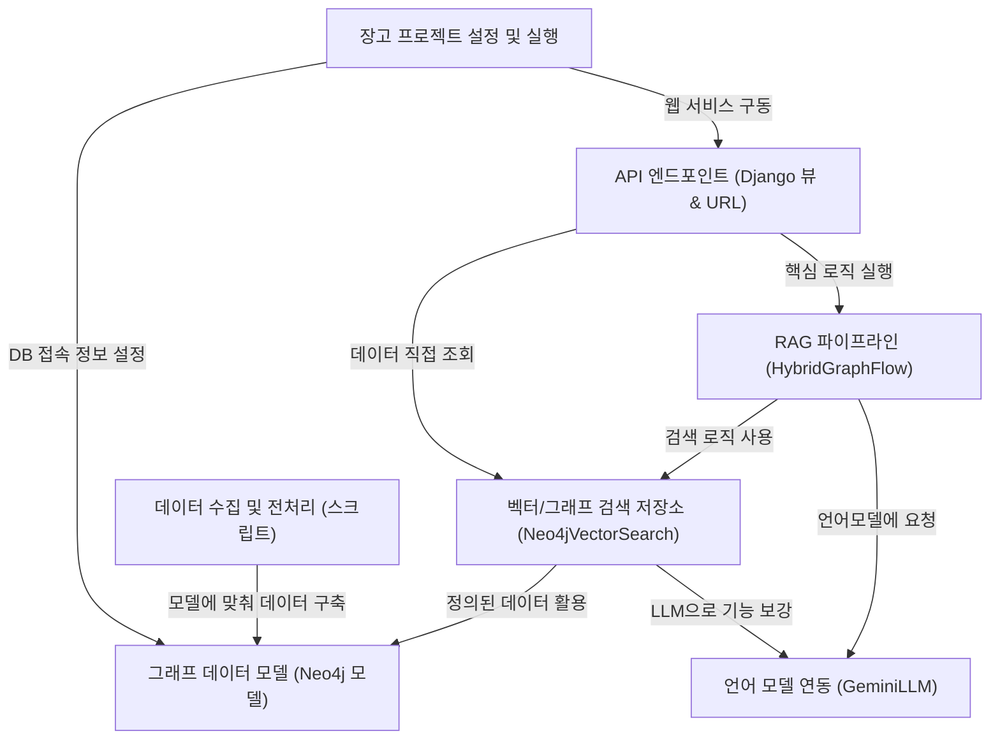

# Tutorial: SKN10-4th-1Team

이 프로젝트는 **연구 논문**에 대한 *검색 및 질의응답*을 수행하는 RAG (Retrieval Augmented Generation) 시스템입니다. 
사용자의 질문을 이해하고, **Neo4j 그래프 데이터베이스**에 저장된 논문 정보를 *벡터 검색*과 *그래프 검색*을 결합한 하이브리드 방식으로 탐색합니다. 
최종적으로 **Gemini LLM**을 활용하여 자연스러운 한국어 답변을 생성하며, 전체 시스템은 **Django 웹 프레임워크**를 통해 제공됩니다.

**Source Repository:** [None](None)

## Chapters

1. [그래프 데이터 모델 (Neo4j 모델)
](01_그래프_데이터_모델__neo4j_모델__.md)
2. [데이터 수집 및 전처리 (스크립트)
](02_데이터_수집_및_전처리__스크립트__.md)
3. [언어 모델 연동 (GeminiLLM)
](03_언어_모델_연동__geminillm__.md)
4. [벡터/그래프 검색 저장소 (Neo4jVectorSearch)
](04_벡터_그래프_검색_저장소__neo4jvectorsearch__.md)
5. [RAG 파이프라인 (HybridGraphFlow)
](05_rag_파이프라인__hybridgraphflow__.md)
6. [API 엔드포인트 (Django 뷰 & URL)
](06_api_엔드포인트__django_뷰___url__.md)
7. [장고 프로젝트 설정 및 실행
](07_장고_프로젝트_설정_및_실행_.md)

---

Generated by [AI Codebase Knowledge Builder](https://github.com/The-Pocket/Tutorial-Codebase-Knowledge)