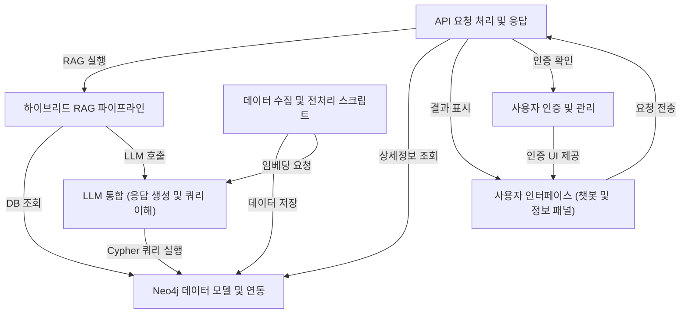

# Tutorial: SKN10-4th-1Team

이 프로젝트는 **의학 논문**을 *쉽고 빠르게* 검색하고 그 내용을 이해하도록 돕는 AI 시스템입니다.
사용자가 질문을 하면, 시스템은 *복합적인 검색 방식*(RAG 파이프라인)으로 최적의 정보를 찾고, 대규모 언어 모델(LLM)을 활용해 **자연스러운 한국어 답변**과 관련 정보를 제공합니다.
사용자는 웹 기반 챗봇과 정보 패널을 통해 이 모든 기능과 상호작용하며, 논문 데이터는 Neo4j 그래프 데이터베이스에 저장 및 관리됩니다.

**Source Repository:** [None](None)

## Chapters

1. [LLM 통합 (응답 생성 및 쿼리 이해)
](01_llm_통합__응답_생성_및_쿼리_이해__.md)
2. [하이브리드 RAG 파이프라인
](02_하이브리드_rag_파이프라인_.md)
3. [Neo4j 데이터 모델 및 연동
](03_neo4j_데이터_모델_및_연동_.md)
4. [데이터 수집 및 전처리 스크립트
](04_데이터_수집_및_전처리_스크립트_.md)
5. [사용자 인터페이스 (챗봇 및 정보 패널)
](05_사용자_인터페이스__챗봇_및_정보_패널__.md)
6. [API 요청 처리 및 응답
](06_api_요청_처리_및_응답_.md)
7. [사용자 인증 및 관리
](07_사용자_인증_및_관리_.md)

---

Generated by [AI Codebase Knowledge Builder](https://github.com/The-Pocket/Tutorial-Codebase-Knowledge)